# Bộ sơ đồ hệ thống thuyết minh tự động đa ngôn ngữ – Bản hoàn chỉnh v3

> **Nguồn nghiệp vụ:** `dac_ta_use_case_hoan_chinh_v2.docx`, 29 trang, 34 Use Case.
> **Mục tiêu:** chuyển đặc tả thành bộ sơ đồ có thể chỉnh sửa bằng Mermaid/PlantUML.
> **Nguyên tắc:** luồng nghiệp vụ lấy từ đặc tả; các quyết định mô hình hóa được đánh dấu riêng; không tự thêm nghiệp vụ chưa được quy định.

## 0. Phạm vi và quy ước

- 01 Use Case Diagram UML (PlantUML), bao phủ UC01–UC34.
- **34 Activity Diagram độc lập**, mỗi sơ đồ tương ứng đúng một UC. Các luồng phụ/ngoại lệ được đưa vào nhánh quyết định hoặc nhánh lỗi.
- 01 State Diagram cho vòng đời Content Version.
- 01 ERD logic; các thực thể suy ra để đáp ứng UC34 được đánh dấu là đề xuất.
- 06 Sequence Diagram cho các luồng liên thành phần có ý nghĩa kiến trúc.
- 01 Component Diagram.
- 01 ma trận truy vết.

**Ký hiệu:** `Draft` = Bản nháp; `Pending Review` = Chờ duyệt; `Rejected` = Bị từ chối; `Published` = Đã xuất bản; `Removed` = Đã gỡ; `Superseded` = Đã thay thế. `NeedsReview` là cờ rà soát của nội dung bản dịch, **không phải trạng thái phiên bản**.

**Giới hạn nguồn:** đặc tả không quy định chi tiết UI, schema API, nhà cung cấp dịch/TTS, chiến lược retry/backoff, định dạng event analytics, retention, hay công nghệ triển khai. Các sơ đồ không tự quyết định các chi tiết đó.

## 1. Use Case Diagram (PlantUML – UML)

```plantuml
@startuml
left to right direction
skinparam packageStyle rectangle
actor Administrator as Admin
actor "Content Manager" as CM
actor Visitor
actor "Dịch vụ dịch tự động" as MT
actor "Dịch vụ TTS" as TTS

rectangle "Hệ thống thuyết minh tự động đa ngôn ngữ" {

  usecase "UC01 - Đăng nhập" as U01
  usecase "UC02 - Đăng xuất" as U02
  usecase "UC03 - Đổi mật khẩu" as U03
  usecase "UC04 - Khôi phục mật khẩu" as U04
  usecase "UC05 - Quản lý tài khoản nhân sự" as U05
  usecase "UC06 - Xem danh sách và chi tiết địa điểm" as U06
  usecase "UC07 - Quản lý địa điểm" as U07
  usecase "UC08 - Xem danh sách và chi tiết POI" as U08
  usecase "UC09 - Quản lý POI" as U09
  usecase "UC10 - Quản lý ngôn ngữ" as U10
  usecase "UC11 - Thiết lập giọng đọc mặc định theo ngôn ngữ" as U11
  usecase "UC12 - Xem danh sách và chi tiết nội dung thuyết minh" as U12
  usecase "UC13 - Tạo nội dung thuyết minh" as U13
  usecase "UC14 - Cập nhật và gửi duyệt nội dung thuyết minh" as U14
  usecase "UC15 - Kiểm duyệt và xuất bản nội dung" as U15
  usecase "UC16 - Gỡ xuất bản và xuất bản lại nội dung" as U16
  usecase "UC17 - Yêu cầu dịch tự động" as U17
  usecase "UC18 - Rà soát và chỉnh sửa bản dịch" as U18
  usecase "UC19 - Chọn giọng đọc" as U19
  usecase "UC20 - Yêu cầu tạo audio TTS" as U20
  usecase "UC21 - Nghe thử audio" as U21
  usecase "UC22 - Quản lý audio" as U22
  usecase "UC23 - Truy cập trang web thuyết minh" as U23
  usecase "UC24 - Chọn ngôn ngữ sử dụng" as U24
  usecase "UC25 - Duyệt và chọn địa điểm tham quan" as U25
  usecase "UC26 - Xem danh sách POI" as U26
  usecase "UC27 - Xem nội dung thuyết minh" as U27
  usecase "UC28 - Nghe thuyết minh" as U28
  usecase "UC29 - Điều khiển trình phát audio" as U29
  usecase "UC30 - Chuyển ngôn ngữ thuyết minh" as U30
  usecase "UC31 - Xem lịch sử nghe trên thiết bị" as U31
  usecase "UC32 - Quản lý QR Code cho POI" as U32
  usecase "UC33 - Quét QR Code và truy cập POI" as U33
  usecase "UC34 - Xem thống kê hoạt động" as U34
}
Admin -- U01
CM -- U01
Admin -- U02
CM -- U02
Admin -- U03
CM -- U03
Admin -- U04
CM -- U04
Admin -- U05
Admin -- U06
CM -- U06
Admin -- U07
Admin -- U08
CM -- U08
Admin -- U09
CM -- U09
Admin -- U10
Admin -- U11
Admin -- U12
CM -- U12
Admin -- U13
CM -- U13
Admin -- U14
CM -- U14
Admin -- U15
Admin -- U16
Admin -- U17
CM -- U17
MT -- U17
Admin -- U18
CM -- U18
Admin -- U19
CM -- U19
Admin -- U20
CM -- U20
TTS -- U20
Admin -- U21
CM -- U21
Admin -- U22
CM -- U22
Visitor -- U23
Visitor -- U24
Visitor -- U25
Visitor -- U26
Visitor -- U27
Visitor -- U28
Visitor -- U29
Visitor -- U30
Visitor -- U31
Admin -- U32
CM -- U32
Visitor -- U33
Admin -- U34
U19 .> U20 : <<extend>>
@enduml
```

> Chỉ vẽ một quan hệ `extend`: UC19 → UC20, vì UC20 bước 3 mô tả việc đổi giọng đọc (UC19) là bước tùy chọn, và bắt buộc khi ngôn ngữ chưa có giọng mặc định. Không vẽ `include`/`extend` khác vì đặc tả chỉ mô tả các UC liên quan và điều hướng nghiệp vụ. Không gán MT/TTS vào các UC khác ngoài UC17/UC20.

## 2. Activity Diagram – 34 sơ đồ độc lập

### UC01 – Đăng nhập

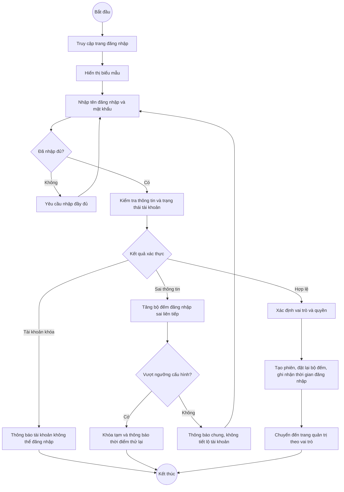
```mermaid
flowchart TD
 S((Bắt đầu)) --> A[Truy cập trang đăng nhập]
 A --> B[Hiển thị biểu mẫu]
 B --> C[Nhập tên đăng nhập và mật khẩu]
 C --> D{Đã nhập đủ?}
 D -- Không --> E[Yêu cầu nhập đầy đủ] --> C
 D -- Có --> F[Kiểm tra thông tin và trạng thái tài khoản]
 F --> G{Kết quả xác thực}
 G -- Tài khoản khóa --> I[Thông báo tài khoản không thể đăng nhập] --> Z((Kết thúc))
 G -- Sai thông tin --> H[Tăng bộ đếm đăng nhập sai liên tiếp]
 H --> H2{Vượt ngưỡng cấu hình?}
 H2 -- Có --> J[Khóa tạm và thông báo thời điểm thử lại] --> Z
 H2 -- Không --> H3[Thông báo chung, không tiết lộ tài khoản] --> C
 G -- Hợp lệ --> K[Xác định vai trò và quyền]
 K --> L[Tạo phiên, đặt lại bộ đếm, ghi nhận thời gian đăng nhập]
 L --> M[Chuyển đến trang quản trị theo vai trò]
 M --> Z
```

### UC02 – Đăng xuất

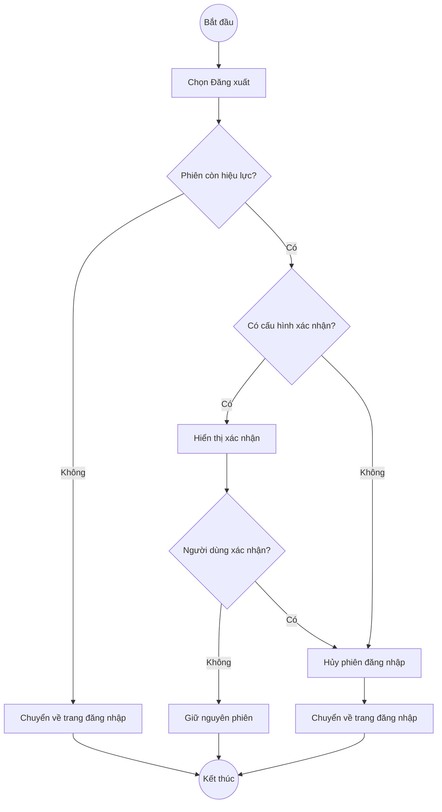
```mermaid
flowchart TD
 S((Bắt đầu)) --> A[Chọn Đăng xuất]
 A --> B{Phiên còn hiệu lực?}
 B -- Không --> C[Chuyển về trang đăng nhập] --> Z((Kết thúc))
 B -- Có --> D{Có cấu hình xác nhận?}
 D -- Có --> E[Hiển thị xác nhận]
 D -- Không --> G[Hủy phiên đăng nhập]
 E --> F{Người dùng xác nhận?}
 F -- Không --> H[Giữ nguyên phiên] --> Z
 F -- Có --> G
 G --> I[Chuyển về trang đăng nhập]
 I --> Z
```

### UC03 – Đổi mật khẩu

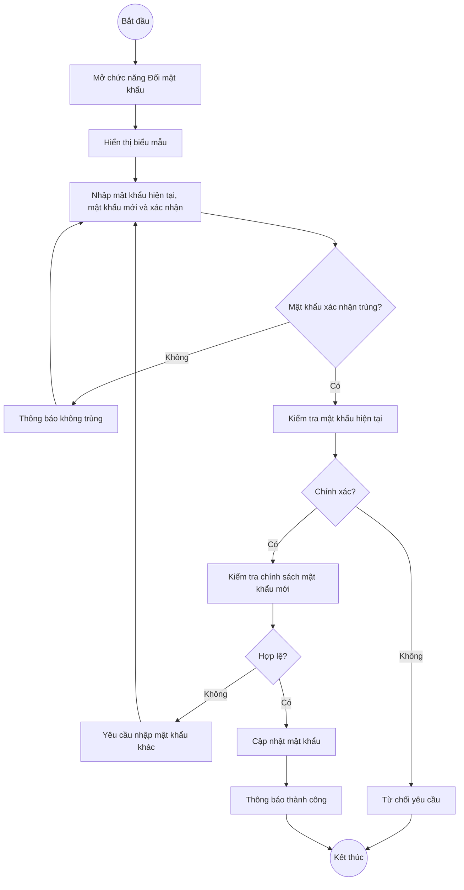
```mermaid
flowchart TD
 S((Bắt đầu)) --> A[Mở chức năng Đổi mật khẩu]
 A --> B[Hiển thị biểu mẫu]
 B --> C[Nhập mật khẩu hiện tại, mật khẩu mới và xác nhận]
 C --> D{Mật khẩu xác nhận trùng?}
 D -- Không --> E[Thông báo không trùng] --> C
 D -- Có --> F[Kiểm tra mật khẩu hiện tại]
 F --> G{Chính xác?}
 G -- Không --> H[Từ chối yêu cầu] --> Z((Kết thúc))
 G -- Có --> I[Kiểm tra chính sách mật khẩu mới]
 I --> J{Hợp lệ?}
 J -- Không --> K[Yêu cầu nhập mật khẩu khác] --> C
 J -- Có --> L[Cập nhật mật khẩu]
 L --> M[Thông báo thành công]
 M --> Z
```

### UC04 – Khôi phục mật khẩu

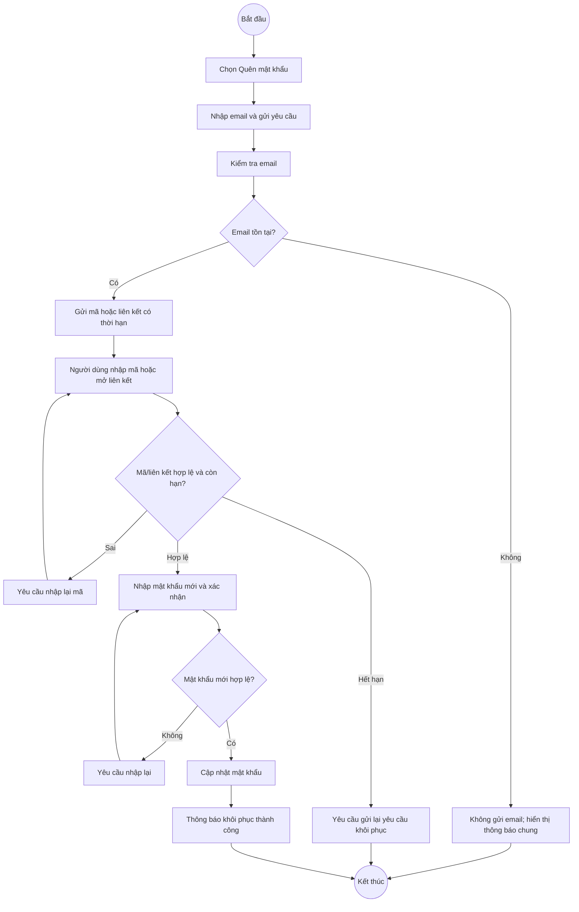
```mermaid
flowchart TD
 S((Bắt đầu)) --> A[Chọn Quên mật khẩu]
 A --> B[Nhập email và gửi yêu cầu]
 B --> C[Kiểm tra email]
 C --> D{Email tồn tại?}
 D -- Không --> E[Không gửi email; hiển thị thông báo chung] --> Z((Kết thúc))
 D -- Có --> F[Gửi mã hoặc liên kết có thời hạn]
 F --> G[Người dùng nhập mã hoặc mở liên kết]
 G --> H{Mã/liên kết hợp lệ và còn hạn?}
 H -- Sai --> I[Yêu cầu nhập lại mã] --> G
 H -- Hết hạn --> J[Yêu cầu gửi lại yêu cầu khôi phục] --> Z
 H -- Hợp lệ --> K[Nhập mật khẩu mới và xác nhận]
 K --> L{Mật khẩu mới hợp lệ?}
 L -- Không --> M[Yêu cầu nhập lại] --> K
 L -- Có --> N[Cập nhật mật khẩu]
 N --> O[Thông báo khôi phục thành công]
 O --> Z
```

### UC05 – Quản lý tài khoản nhân sự

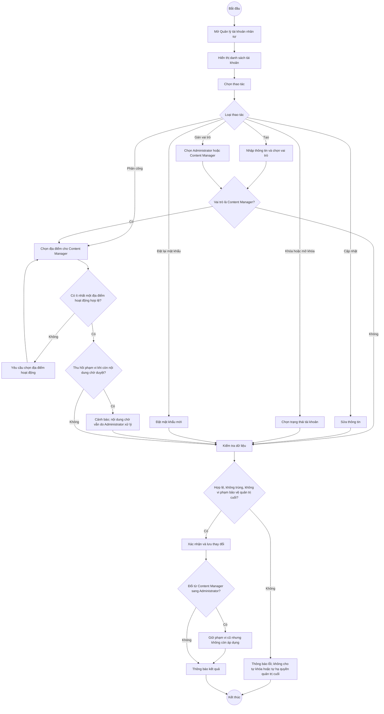
```mermaid
flowchart TD
 S((Bắt đầu)) --> A[Mở Quản lý tài khoản nhân sự]
 A --> B[Hiển thị danh sách tài khoản]
 B --> C[Chọn thao tác]
 C --> D{Loại thao tác}
 D -- Tạo --> E[Nhập thông tin và chọn vai trò]
 D -- Cập nhật --> F[Sửa thông tin]
 D -- Khóa hoặc mở khóa --> G[Chọn trạng thái tài khoản]
 D -- Đặt lại mật khẩu --> H[Đặt mật khẩu mới]
 D -- Gán vai trò --> I[Chọn Administrator hoặc Content Manager]
 D -- Phân công --> J[Chọn địa điểm cho Content Manager]
 E --> L{Vai trò là Content Manager?}
 I --> L
 L -- Có --> J
 L -- Không --> K[Kiểm tra dữ liệu]
 F --> K
 G --> K
 H --> K
 J --> M{Có ít nhất một địa điểm hoạt động hợp lệ?}
 M -- Không --> N[Yêu cầu chọn địa điểm hoạt động] --> J
 M -- Có --> T{Thu hồi phạm vi khi còn nội dung chờ duyệt?}
 T -- Có --> U[Cảnh báo; nội dung chờ vẫn do Administrator xử lý] --> K
 T -- Không --> K
 K --> O{Hợp lệ, không trùng, không vi phạm bảo vệ quản trị cuối?}
 O -- Không --> P[Thông báo lỗi; không cho tự khóa hoặc tự hạ quyền quản trị cuối] --> Z((Kết thúc))
 O -- Có --> Q[Xác nhận và lưu thay đổi]
 Q --> R{Đổi từ Content Manager sang Administrator?}
 R -- Có --> V[Giữ phạm vi cũ nhưng không còn áp dụng] --> W[Thông báo kết quả]
 R -- Không --> W
 W --> Z
```

### UC06 – Xem danh sách và chi tiết địa điểm

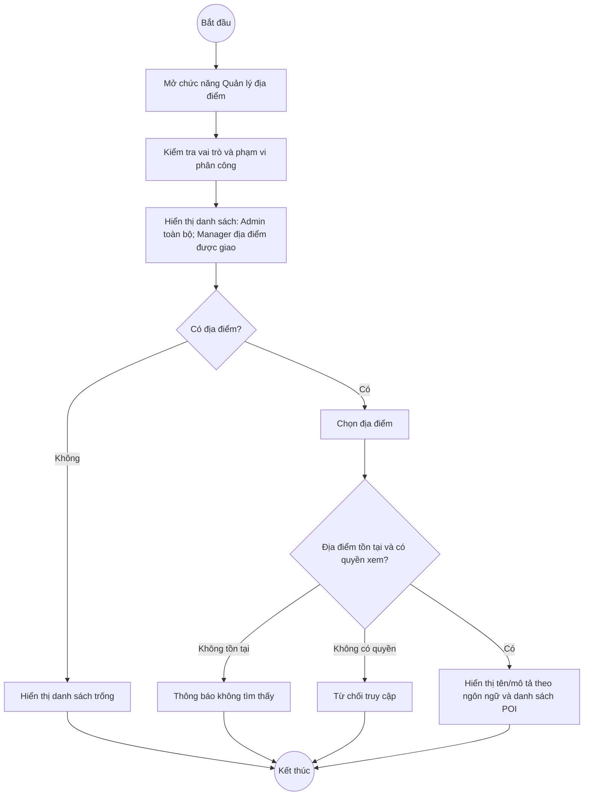
```mermaid
flowchart TD
 S((Bắt đầu)) --> A[Mở chức năng Quản lý địa điểm]
 A --> B[Kiểm tra vai trò và phạm vi phân công]
 B --> C[Hiển thị danh sách: Admin toàn bộ; Manager địa điểm được giao]
 C --> D{Có địa điểm?}
 D -- Không --> E[Hiển thị danh sách trống] --> Z((Kết thúc))
 D -- Có --> F[Chọn địa điểm]
 F --> G{Địa điểm tồn tại và có quyền xem?}
 G -- Không tồn tại --> H[Thông báo không tìm thấy] --> Z
 G -- Không có quyền --> I[Từ chối truy cập] --> Z
 G -- Có --> J[Hiển thị tên/mô tả theo ngôn ngữ và danh sách POI]
 J --> Z
```

### UC07 – Quản lý địa điểm

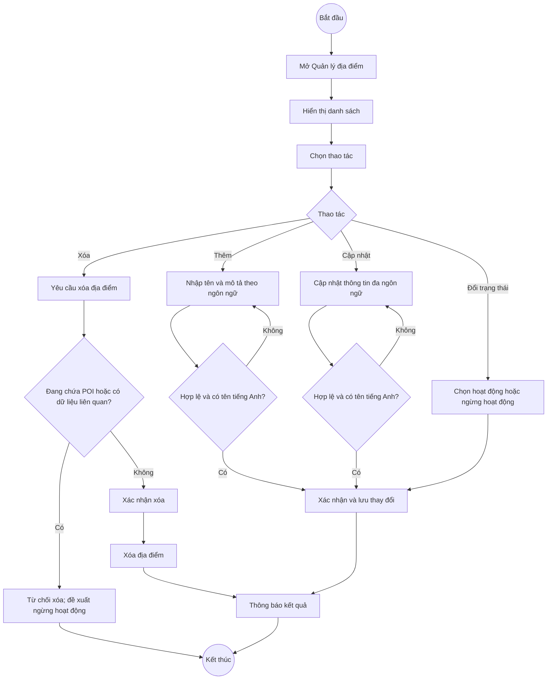
```mermaid
flowchart TD
 S((Bắt đầu)) --> A[Mở Quản lý địa điểm]
 A --> B[Hiển thị danh sách]
 B --> C[Chọn thao tác]
 C --> D{Thao tác}
 D -- Thêm --> E[Nhập tên và mô tả theo ngôn ngữ]
 D -- Cập nhật --> F[Cập nhật thông tin đa ngôn ngữ]
 D -- Đổi trạng thái --> H[Chọn hoạt động hoặc ngừng hoạt động]
 D -- Xóa --> G[Yêu cầu xóa địa điểm]
 E --> I{Hợp lệ và có tên tiếng Anh?}
 I -- Không --> E
 I -- Có --> Q[Xác nhận và lưu thay đổi]
 F --> I2{Hợp lệ và có tên tiếng Anh?}
 I2 -- Không --> F
 I2 -- Có --> Q
 H --> Q
 G --> J{Đang chứa POI hoặc có dữ liệu liên quan?}
 J -- Có --> K[Từ chối xóa; đề xuất ngừng hoạt động] --> Z((Kết thúc))
 J -- Không --> L[Xác nhận xóa] --> M[Xóa địa điểm] --> N[Thông báo kết quả]
 Q --> N
 N --> Z
```

### UC08 – Xem danh sách và chi tiết POI

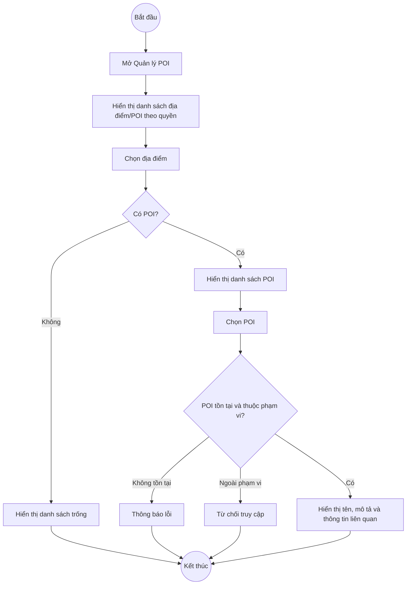
```mermaid
flowchart TD
 S((Bắt đầu)) --> A[Mở Quản lý POI]
 A --> B[Hiển thị danh sách địa điểm/POI theo quyền]
 B --> C[Chọn địa điểm]
 C --> D{Có POI?}
 D -- Không --> E[Hiển thị danh sách trống] --> Z((Kết thúc))
 D -- Có --> F[Hiển thị danh sách POI]
 F --> G[Chọn POI]
 G --> H{POI tồn tại và thuộc phạm vi?}
 H -- Không tồn tại --> I[Thông báo lỗi] --> Z
 H -- Ngoài phạm vi --> J[Từ chối truy cập] --> Z
 H -- Có --> K[Hiển thị tên, mô tả và thông tin liên quan]
 K --> Z
```

### UC09 – Quản lý POI

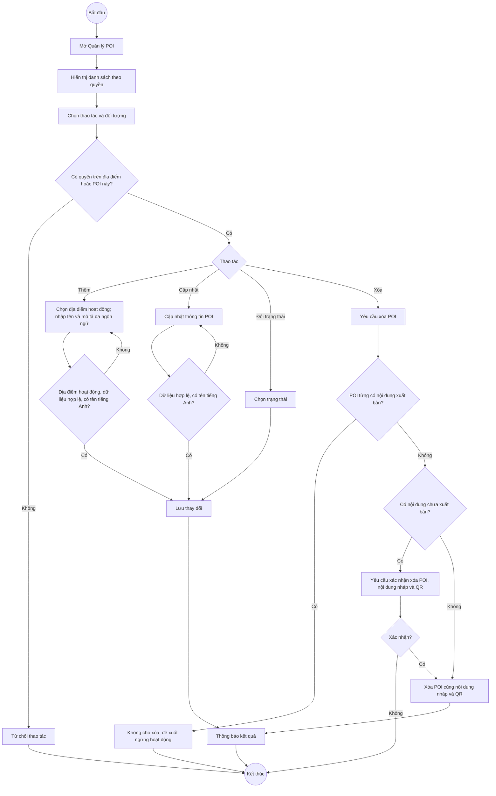
```mermaid
flowchart TD
 S((Bắt đầu)) --> A[Mở Quản lý POI]
 A --> B[Hiển thị danh sách theo quyền]
 B --> C[Chọn thao tác và đối tượng]
 C --> D{Có quyền trên địa điểm hoặc POI này?}
 D -- Không --> R[Từ chối thao tác] --> Z((Kết thúc))
 D -- Có --> O{Thao tác}
 O -- Thêm --> E[Chọn địa điểm hoạt động; nhập tên và mô tả đa ngôn ngữ]
 O -- Cập nhật --> F[Cập nhật thông tin POI]
 O -- Đổi trạng thái --> H[Chọn trạng thái]
 O -- Xóa --> G[Yêu cầu xóa POI]
 E --> V{Địa điểm hoạt động, dữ liệu hợp lệ, có tên tiếng Anh?}
 V -- Không --> E
 V -- Có --> T[Lưu thay đổi]
 F --> V2{Dữ liệu hợp lệ, có tên tiếng Anh?}
 V2 -- Không --> F
 V2 -- Có --> T
 H --> T
 T --> P[Thông báo kết quả]
 G --> J{POI từng có nội dung xuất bản?}
 J -- Có --> K[Không cho xóa; đề xuất ngừng hoạt động] --> Z
 J -- Không --> L{Có nội dung chưa xuất bản?}
 L -- Có --> M[Yêu cầu xác nhận xóa POI, nội dung nháp và QR] --> N{Xác nhận?}
 N -- Không --> Z
 N -- Có --> X[Xóa POI cùng nội dung nháp và QR]
 L -- Không --> X
 X --> P
 P --> Z
```

### UC10 – Quản lý ngôn ngữ

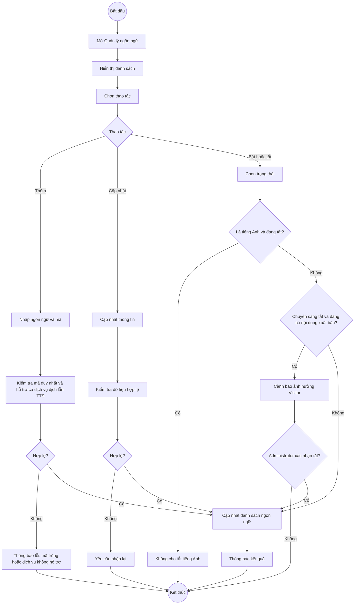
```mermaid
flowchart TD
 S((Bắt đầu)) --> A[Mở Quản lý ngôn ngữ]
 A --> B[Hiển thị danh sách]
 B --> C[Chọn thao tác]
 C --> D{Thao tác}
 D -- Thêm --> E[Nhập ngôn ngữ và mã]
 D -- Cập nhật --> F[Cập nhật thông tin]
 D -- Bật hoặc tắt --> G[Chọn trạng thái]
 E --> H[Kiểm tra mã duy nhất và hỗ trợ cả dịch vụ dịch lẫn TTS]
 H --> N{Hợp lệ?}
 N -- Không --> O[Thông báo lỗi: mã trùng hoặc dịch vụ không hỗ trợ] --> Z((Kết thúc))
 N -- Có --> P[Cập nhật danh sách ngôn ngữ]
 F --> H2[Kiểm tra dữ liệu hợp lệ]
 H2 --> N2{Hợp lệ?}
 N2 -- Không --> O2[Yêu cầu nhập lại] --> Z
 N2 -- Có --> P
 G --> I{Là tiếng Anh và đang tắt?}
 I -- Có --> J[Không cho tắt tiếng Anh] --> Z
 I -- Không --> K{Chuyển sang tắt và đang có nội dung xuất bản?}
 K -- Có --> L[Cảnh báo ảnh hưởng Visitor]
 L --> M{Administrator xác nhận tắt?}
 M -- Không --> Z
 M -- Có --> P
 K -- Không --> P
 P --> Q[Thông báo kết quả]
 Q --> Z
```

### UC11 – Thiết lập giọng đọc mặc định theo ngôn ngữ

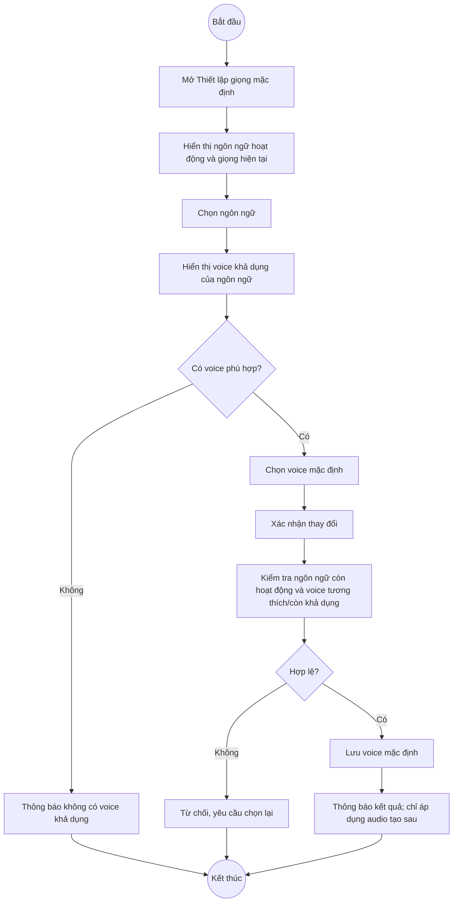
```mermaid
flowchart TD
 S((Bắt đầu)) --> A[Mở Thiết lập giọng mặc định]
 A --> B[Hiển thị ngôn ngữ hoạt động và giọng hiện tại]
 B --> C[Chọn ngôn ngữ]
 C --> D[Hiển thị voice khả dụng của ngôn ngữ]
 D --> E{Có voice phù hợp?}
 E -- Không --> F[Thông báo không có voice khả dụng] --> Z((Kết thúc))
 E -- Có --> G[Chọn voice mặc định]
 G --> H[Xác nhận thay đổi]
 H --> I[Kiểm tra ngôn ngữ còn hoạt động và voice tương thích/còn khả dụng]
 I --> J{Hợp lệ?}
 J -- Không --> K[Từ chối, yêu cầu chọn lại] --> Z
 J -- Có --> L[Lưu voice mặc định]
 L --> M[Thông báo kết quả; chỉ áp dụng audio tạo sau]
 M --> Z
```

### UC12 – Xem danh sách và chi tiết nội dung thuyết minh

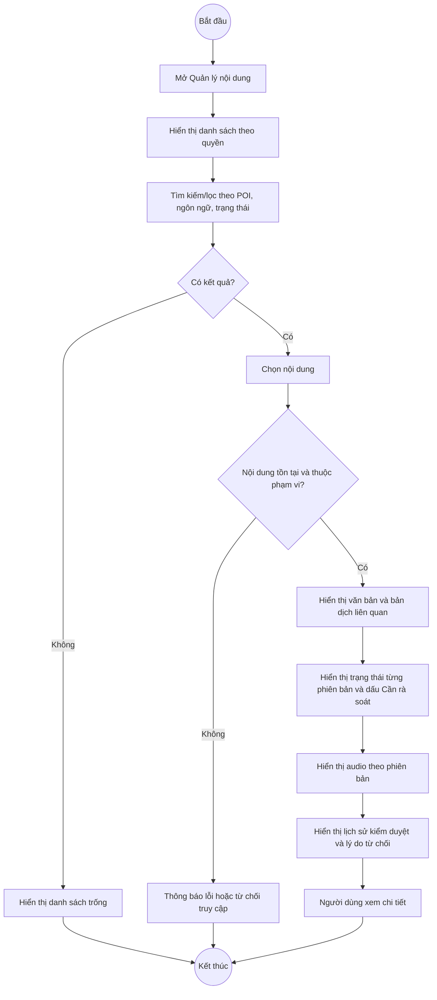
```mermaid
flowchart TD
 S((Bắt đầu)) --> A[Mở Quản lý nội dung]
 A --> B[Hiển thị danh sách theo quyền]
 B --> C[Tìm kiếm/lọc theo POI, ngôn ngữ, trạng thái]
 C --> D{Có kết quả?}
 D -- Không --> E[Hiển thị danh sách trống] --> Z((Kết thúc))
 D -- Có --> F[Chọn nội dung]
 F --> G{Nội dung tồn tại và thuộc phạm vi?}
 G -- Không --> H[Thông báo lỗi hoặc từ chối truy cập] --> Z
 G -- Có --> I[Hiển thị văn bản và bản dịch liên quan]
 I --> J[Hiển thị trạng thái từng phiên bản và dấu Cần rà soát]
 J --> K[Hiển thị audio theo phiên bản]
 K --> L[Hiển thị lịch sử kiểm duyệt và lý do từ chối]
 L --> M[Người dùng xem chi tiết]
 M --> Z
```

### UC13 – Tạo nội dung thuyết minh

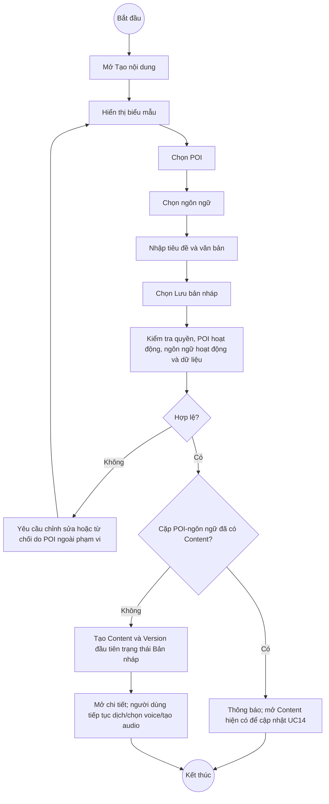
```mermaid
flowchart TD
 S((Bắt đầu)) --> A[Mở Tạo nội dung]
 A --> B[Hiển thị biểu mẫu]
 B --> C[Chọn POI]
 C --> D[Chọn ngôn ngữ]
 D --> E[Nhập tiêu đề và văn bản]
 E --> F[Chọn Lưu bản nháp]
 F --> G[Kiểm tra quyền, POI hoạt động, ngôn ngữ hoạt động và dữ liệu]
 G --> H{Hợp lệ?}
 H -- Không --> I[Yêu cầu chỉnh sửa hoặc từ chối do POI ngoài phạm vi] --> B
 H -- Có --> J{Cặp POI-ngôn ngữ đã có Content?}
 J -- Có --> K[Thông báo; mở Content hiện có để cập nhật UC14] --> Z((Kết thúc))
 J -- Không --> L[Tạo Content và Version đầu tiên trạng thái Bản nháp]
 L --> M[Mở chi tiết; người dùng tiếp tục dịch/chọn voice/tạo audio]
 M --> Z
```

### UC14 – Cập nhật và gửi duyệt nội dung thuyết minh

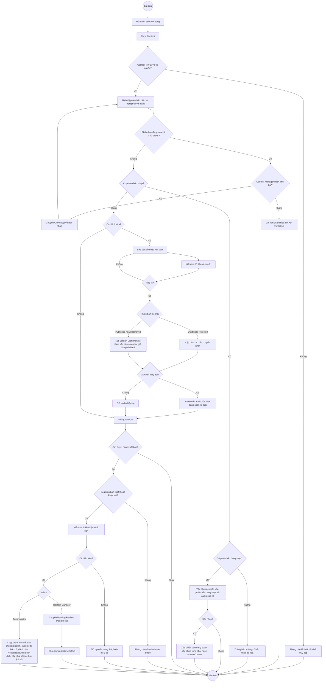
```mermaid
flowchart TD
 S((Bắt đầu)) --> A[Mở danh sách nội dung]
 A --> B[Chọn Content]
 B --> C{Content tồn tại và có quyền?}
 C -- Không --> D[Thông báo lỗi hoặc từ chối truy cập] --> Z((Kết thúc))
 C -- Có --> E[Hiển thị phiên bản hiện tại, trạng thái và audio]
 E --> F{Phiên bản đang soạn là Chờ duyệt?}
 F -- Có --> G{Content Manager chọn Thu hồi?}
 G -- Có --> H[Chuyển Chờ duyệt về Bản nháp] --> E
 G -- Không --> I[Chỉ xem; Administrator xử lý ở UC15] --> Z
 F -- Không --> J{Chọn xóa bản nháp?}
 J -- Có --> J2{Có phiên bản đang soạn?}
 J2 -- Không --> J3[Thông báo không có bản nháp để xóa] --> Z
 J2 -- Có --> K[Yêu cầu xác nhận xóa phiên bản đang soạn và audio của nó]
 K --> L{Xác nhận?}
 L -- Không --> Z
 L -- Có --> M[Xóa phiên bản đang soạn; nếu chưa từng phát hành thì xóa Content] --> Z
 J -- Không --> N{Có chỉnh sửa?}
 N -- Có --> O[Sửa tiêu đề hoặc văn bản]
 O --> P[Kiểm tra dữ liệu và quyền]
 P --> Q{Hợp lệ?}
 Q -- Không --> O
 Q -- Có --> R{Phiên bản hiện tại}
 R -- Draft hoặc Rejected --> T[Cập nhật tại chỗ; chuyển Draft]
 R -- Published hoặc Removed --> U[Tạo Version Draft mới; kế thừa văn bản và audio; giữ bản phát hành]
 T --> V{Văn bản thay đổi?}
 U --> V
 V -- Có --> W[Đánh dấu audio của bản đang soạn lỗi thời]
 V -- Không --> X[Giữ audio hiện tại]
 W --> Y[Thông báo lưu]
 X --> Y
 N -- Không --> Y
 Y --> AA{Gửi duyệt hoặc xuất bản?}
 AA -- Chưa --> Z
 AA -- Có --> AA2{Có phiên bản Draft hoặc Rejected?}
 AA2 -- Không --> AA3[Thông báo cần chỉnh sửa trước] --> Z
 AA2 -- Có --> AB[Kiểm tra 5 điều kiện xuất bản]
 AB --> AC{Đủ điều kiện?}
 AC -- Không --> AD[Giữ nguyên trạng thái; hiển thị lý do] --> Z
 AC -- Có --> AE{Vai trò}
 AE -- Content Manager --> AF[Chuyển Pending Review; chặn gửi lặp] --> AG[Chờ Administrator ở UC15] --> Z
 AE -- Administrator --> AH[Chạy quy trình xuất bản chung: publish, supersede bản cũ, đánh dấu NeedsReview cho bản dịch, cập nhật Visitor, lưu lịch sử] --> Z
```

### UC15 – Kiểm duyệt và xuất bản nội dung

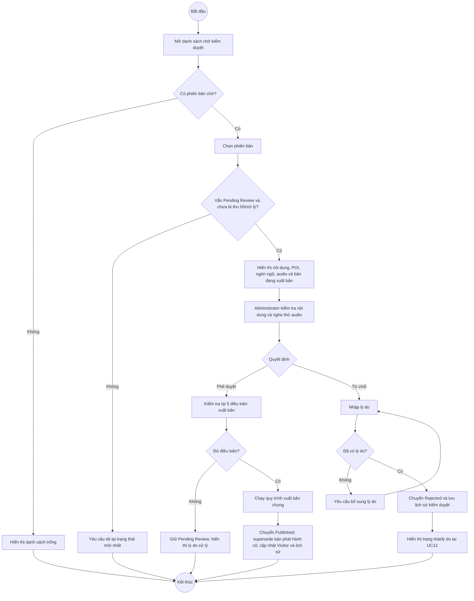
```mermaid
flowchart TD
 S((Bắt đầu)) --> A[Mở danh sách chờ kiểm duyệt]
 A --> B{Có phiên bản chờ?}
 B -- Không --> C[Hiển thị danh sách trống] --> Z((Kết thúc))
 B -- Có --> D[Chọn phiên bản]
 D --> E{Vẫn Pending Review và chưa bị thu hồi/xử lý?}
 E -- Không --> F[Yêu cầu tải lại trạng thái mới nhất] --> Z
 E -- Có --> G[Hiển thị nội dung, POI, ngôn ngữ, audio và bản đang xuất bản]
 G --> H[Administrator kiểm tra nội dung và nghe thử audio]
 H --> I{Quyết định}
 I -- Phê duyệt --> J[Kiểm tra lại 5 điều kiện xuất bản]
 J --> K{Đủ điều kiện?}
 K -- Không --> L[Giữ Pending Review; hiển thị lý do xử lý] --> Z
 K -- Có --> M[Chạy quy trình xuất bản chung]
 M --> N[Chuyển Published; supersede bản phát hành cũ; cập nhật Visitor và lịch sử] --> Z
 I -- Từ chối --> O[Nhập lý do]
 O --> P{Đã có lý do?}
 P -- Không --> Q[Yêu cầu bổ sung lý do] --> O
 P -- Có --> R[Chuyển Rejected và lưu lịch sử kiểm duyệt]
 R --> T[Hiển thị trạng thái/lý do tại UC12]
 T --> Z
```

### UC16 – Gỡ xuất bản và xuất bản lại nội dung

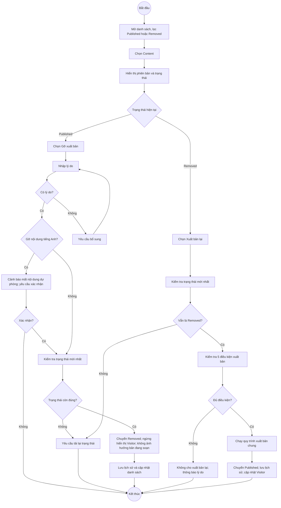
```mermaid
flowchart TD
 S((Bắt đầu)) --> A[Mở danh sách, lọc Published hoặc Removed]
 A --> B[Chọn Content]
 B --> C[Hiển thị phiên bản và trạng thái]
 C --> D{Trạng thái hiện tại}
 D -- Published --> E[Chọn Gỡ xuất bản]
 D -- Removed --> F[Chọn Xuất bản lại]
 E --> G[Nhập lý do]
 G --> H{Có lý do?}
 H -- Không --> I[Yêu cầu bổ sung] --> G
 H -- Có --> J{Gỡ nội dung tiếng Anh?}
 J -- Có --> K[Cảnh báo mất nội dung dự phòng; yêu cầu xác nhận]
 K --> L{Xác nhận?}
 L -- Không --> Z((Kết thúc))
 L -- Có --> M[Kiểm tra trạng thái mới nhất]
 J -- Không --> M
 M --> N{Trạng thái còn đúng?}
 N -- Không --> O[Yêu cầu tải lại trạng thái] --> Z
 N -- Có --> P[Chuyển Removed; ngừng hiển thị Visitor; không ảnh hưởng bản đang soạn]
 P --> Q[Lưu lịch sử và cập nhật danh sách] --> Z
 F --> F2[Kiểm tra trạng thái mới nhất]
 F2 --> F3{Vẫn là Removed?}
 F3 -- Không --> O
 F3 -- Có --> R[Kiểm tra 5 điều kiện xuất bản]
 R --> T{Đủ điều kiện?}
 T -- Không --> U[Không cho xuất bản lại; thông báo lý do] --> Z
 T -- Có --> V[Chạy quy trình xuất bản chung]
 V --> W[Chuyển Published; lưu lịch sử; cập nhật Visitor]
 W --> Z
```

### UC17 – Yêu cầu dịch tự động

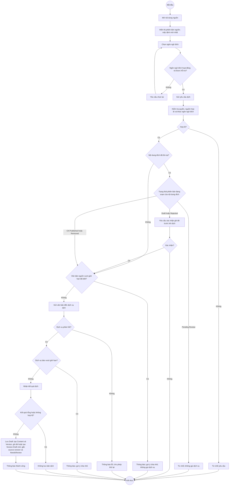
```mermaid
flowchart TD
 S((Bắt đầu)) --> A[Mở nội dung nguồn]
 A --> B[Hiển thị phiên bản nguồn; mặc định mới nhất]
 B --> C[Chọn ngôn ngữ đích]
 C --> D{Ngôn ngữ đích hoạt động và được hỗ trợ?}
 D -- Không --> E[Yêu cầu chọn lại] --> C
 D -- Có --> F[Gửi yêu cầu dịch]
 F --> G[Kiểm tra quyền, nguồn hợp lệ và khác ngôn ngữ đích]
 G --> H{Hợp lệ?}
 H -- Không --> I[Từ chối yêu cầu] --> Z((Kết thúc))
 H -- Có --> R{Nội dung đích đã tồn tại?}
 R -- Không --> LM
 R -- Có --> U{Trạng thái phiên bản đang soạn của nội dung đích}
 U -- Pending Review --> AA[Từ chối; không gọi dịch vụ] --> Z
 U -- Draft hoặc Rejected --> V[Yêu cầu xác nhận ghi đè trước khi dịch]
 V --> W{Xác nhận?}
 W -- Không --> Z
 W -- Có --> LM
 U -- Chỉ Published hoặc Removed --> LM
 LM{Văn bản nguồn vượt giới hạn đã biết?}
 LM -- Có --> N[Thông báo; gợi ý chia nhỏ; không gọi dịch vụ] --> Z
 LM -- Không --> J[Gửi văn bản đến dịch vụ dịch]
 J --> K{Dịch vụ phản hồi?}
 K -- Không --> L[Thông báo lỗi; cho phép thử lại] --> Z
 K -- Có --> M{Dịch vụ báo vượt giới hạn?}
 M -- Có --> N2[Thông báo; gợi ý chia nhỏ] --> Z
 M -- Không --> O[Nhận kết quả dịch]
 O --> P{Kết quả rỗng hoặc không hợp lệ?}
 P -- Có --> Q[Không lưu bản dịch] --> Z
 P -- Không --> X[Lưu Draft: tạo Content và Version, ghi đè hoặc tạo Version Draft mới; gắn source-version và NeedsReview]
 X --> T[Thông báo thành công] --> Z
```

### UC18 – Rà soát và chỉnh sửa bản dịch

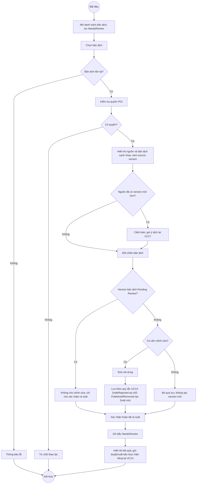
```mermaid
flowchart TD
 S((Bắt đầu)) --> A[Mở danh sách bản dịch, lọc NeedsReview]
 A --> B[Chọn bản dịch]
 B --> C{Bản dịch tồn tại?}
 C -- Không --> D[Thông báo lỗi] --> Z((Kết thúc))
 C -- Có --> E[Kiểm tra quyền POI]
 E --> F{Có quyền?}
 F -- Không --> G[Từ chối thao tác] --> Z
 F -- Có --> H[Hiển thị nguồn và bản dịch cạnh nhau, kèm source version]
 H --> I{Nguồn đã có version mới hơn?}
 I -- Có --> J[Cảnh báo; gợi ý dịch lại UC17]
 I -- Không --> K[Đối chiếu bản dịch]
 J --> K
 K --> L{Version bản dịch Pending Review?}
 L -- Có --> M[Không cho chỉnh sửa; chỉ cho xác nhận rà soát]
 L -- Không --> N{Có cần chỉnh sửa?}
 N -- Có --> O[Sửa nội dung]
 O --> P[Lưu theo quy tắc UC14: Draft/Rejected tại chỗ; Published/Removed tạo Draft mới]
 N -- Không --> Q[Bỏ qua lưu; không tạo version mới]
 M --> R[Xác nhận hoàn tất rà soát]
 P --> R
 Q --> R
 R --> T[Gỡ dấu NeedsReview]
 T --> U[Hiển thị kết quả; gửi duyệt/xuất bản thực hiện riêng tại UC14]
 U --> Z
```

### UC19 – Chọn giọng đọc

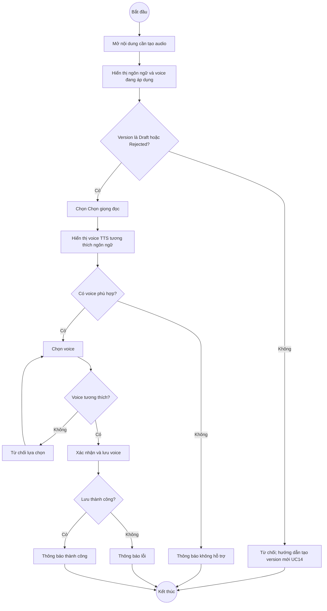
```mermaid
flowchart TD
 S((Bắt đầu)) --> A[Mở nội dung cần tạo audio]
 A --> B[Hiển thị ngôn ngữ và voice đang áp dụng]
 B --> C{Version là Draft hoặc Rejected?}
 C -- Không --> D[Từ chối; hướng dẫn tạo version mới UC14] --> Z((Kết thúc))
 C -- Có --> E[Chọn Chọn giọng đọc]
 E --> F[Hiển thị voice TTS tương thích ngôn ngữ]
 F --> G{Có voice phù hợp?}
 G -- Không --> H[Thông báo không hỗ trợ] --> Z
 G -- Có --> I[Chọn voice]
 I --> J{Voice tương thích?}
 J -- Không --> K[Từ chối lựa chọn] --> I
 J -- Có --> L[Xác nhận và lưu voice]
 L --> M{Lưu thành công?}
 M -- Không --> N[Thông báo lỗi] --> Z
 M -- Có --> O[Thông báo thành công]
 O --> Z
```

### UC20 – Yêu cầu tạo audio TTS

```mermaid
flowchart TD
 S((Bắt đầu)) --> A[Chọn nội dung cần tạo audio]
 A --> B[Hiển thị thông tin nội dung]
 B --> C[Áp dụng voice mặc định; cho phép đổi qua UC19]
 C --> D{Có voice mặc định hoặc voice đã chọn?}
 D -- Không --> E[Yêu cầu chọn voice] --> Z((Kết thúc))
 D -- Có --> F[Gửi yêu cầu tạo audio]
 F --> G[Kiểm tra văn bản, voice, trạng thái version và độ dài]
 G --> H{Draft hoặc Rejected, dữ liệu hợp lệ, không vượt giới hạn?}
 H -- Không --> I[Từ chối; nếu Pending hoặc Published hướng dẫn tạo version mới; nếu quá dài gợi ý chia nhỏ] --> Z
 H -- Có --> J{Đã có audio?}
 J -- Có --> K[Yêu cầu xác nhận thay thế]
 K --> L{Xác nhận?}
 L -- Không --> Z
 L -- Có --> M[Gửi văn bản và voice đến TTS]
 J -- Không --> M
 M --> N{TTS thành công?}
 N -- Không --> O[Thông báo lỗi tạo audio; nếu dịch vụ báo quá dài thì gợi ý chia nhỏ] --> Z
 N -- Có --> R[Nhận file audio]
 R --> T{File hợp lệ?}
 T -- Không --> U[Không lưu kết quả] --> Z
 T -- Có --> V[Lưu file và metadata; liên kết đúng version; thay audio cũ nếu được xác nhận]
 V --> W[Thông báo thành công]
 W --> Z
```

### UC21 – Nghe thử audio

```mermaid
flowchart TD
 S((Bắt đầu)) --> A[Truy cập nội dung có audio]
 A --> B[Chọn Nghe thử]
 B --> C[Kiểm tra quyền với POI và tải file]
 C --> D{File tồn tại?}
 D -- Không --> E[Thông báo audio không tồn tại] --> Z((Kết thúc))
 D -- Có --> F{Tải thành công?}
 F -- Không --> G[Yêu cầu thử lại] --> Z
 F -- Có --> H[Hiển thị trình phát]
 H --> I[Người dùng nhấn Phát]
 I --> J{Audio phát được?}
 J -- Không --> K[Thông báo lỗi phát] --> Z
 J -- Có --> L[Phát để người dùng kiểm tra chất lượng]
 L --> M[Người dùng dừng hoặc kết thúc]
 M --> N[Kết thúc nghe thử; không đổi trạng thái xuất bản]
 N --> Z
```

### UC22 – Quản lý audio

```mermaid
flowchart TD
 S((Bắt đầu)) --> A[Mở Quản lý audio]
 A --> B[Hiển thị audio hiện tại của version]
 B --> C{Version Draft hoặc Rejected?}
 C -- Không --> D[Từ chối; hướng dẫn tạo version mới UC14] --> Z((Kết thúc))
 C -- Có --> E[Chọn thao tác]
 E --> F{Tải lên, thay thế hay xóa?}
 F -- Tải lên --> G[Chọn file audio thu sẵn]
 F -- Thay thế --> G
 F -- Xóa --> H[Xác nhận xóa audio]
 H --> I{Xác nhận?}
 I -- Không --> Z
 I -- Có --> J[Kiểm tra quyền và xóa liên kết/file theo quy tắc lưu trữ] --> K[Thông báo kết quả] --> Z
 G --> L[Kiểm tra quyền, định dạng, dung lượng và ngôn ngữ]
 L --> M{Hợp lệ?}
 M -- Không --> N[Từ chối file hoặc yêu cầu sửa] --> Z
 M -- Có --> O[Lưu/thay thế audio và liên kết đúng version]
 O --> K
```

### UC23 – Truy cập trang web thuyết minh

```mermaid
flowchart TD
 S((Bắt đầu)) --> A[Visitor mở website]
 A --> B[Khởi tạo trang]
 B --> C[Đọc ngôn ngữ đã lưu trên thiết bị]
 C --> D{Đã lưu ngôn ngữ?}
 D -- Có --> E[Sử dụng ngôn ngữ đã lưu]
 D -- Không --> F{Ngôn ngữ trình duyệt được hỗ trợ?}
 F -- Có --> G[Dùng ngôn ngữ trình duyệt]
 F -- Không --> H[Dùng tiếng Anh]
 E --> I[Tải cấu hình và dữ liệu]
 G --> I
 H --> I
 I --> J{Kết nối và dữ liệu tải được?}
 J -- Không kết nối --> K[Thông báo lỗi kết nối] --> Z((Kết thúc))
 J -- Dữ liệu lỗi --> L[Thông báo và cho phép thử lại] --> Z
 J -- Có --> M[Hiển thị trang chủ]
 M --> N[Ghi nhận lượt truy cập ẩn danh]
 N --> O[Visitor bắt đầu sử dụng]
 O --> Z
```

### UC24 – Chọn ngôn ngữ sử dụng

```mermaid
flowchart TD
 S((Bắt đầu)) --> A[Mở chức năng Chọn ngôn ngữ]
 A --> B[Tải danh sách ngôn ngữ hoạt động]
 B --> C{Tải thành công?}
 C -- Không --> D[Thông báo lỗi] --> Z((Kết thúc))
 C -- Có --> E[Hiển thị danh sách]
 E --> F[Visitor chọn ngôn ngữ]
 F --> G{Ngôn ngữ còn hoạt động?}
 G -- Không --> H[Yêu cầu chọn ngôn ngữ khác] --> E
 G -- Có --> I[Lưu lựa chọn trên thiết bị]
 I --> J{Lưu được?}
 J -- Có --> K[Cập nhật giao diện và ngôn ngữ ưu tiên]
 J -- Không --> L[Chỉ áp dụng trong phiên hiện tại]
 K --> M[Thông báo lựa chọn thành công]
 L --> M
 M --> Z
```

### UC25 – Duyệt và chọn địa điểm tham quan

```mermaid
flowchart TD
 S((Bắt đầu)) --> A[Mở danh sách địa điểm]
 A --> B[Tải địa điểm đang hoạt động]
 B --> C{Có địa điểm?}
 C -- Không --> D[Thông báo không có địa điểm] --> Z((Kết thúc))
 C -- Có --> E[Hiển thị tên/mô tả theo ngôn ngữ; thiếu thì tiếng Anh]
 E --> F[Visitor chọn địa điểm]
 F --> G{Địa điểm còn hoạt động?}
 G -- Không --> H[Thông báo không thể truy cập] --> Z
 G -- Có --> I[Tải chi tiết địa điểm]
 I --> J{Tải thành công?}
 J -- Không --> K[Thông báo lỗi kết nối] --> Z
 J -- Có --> L[Hiển thị địa điểm được chọn]
 L --> Z
```

### UC26 – Xem danh sách POI

```mermaid
flowchart TD
 S((Bắt đầu)) --> A[Visitor chọn địa điểm]
 A --> B[Tải danh sách POI thuộc địa điểm]
 B --> E[Lọc POI đang hoạt động]
 E --> C{Còn POI hiển thị?}
 C -- Không --> D[Thông báo địa điểm chưa có POI] --> Z((Kết thúc))
 C -- Có --> F[Hiển thị tên và mô tả theo ngôn ngữ; thiếu thì tiếng Anh]
 F --> G[Visitor chọn POI]
 G --> H{POI tồn tại?}
 H -- Không --> I[Thông báo lỗi] --> Z
 H -- Có --> J[Chuyển đến chi tiết POI]
 J --> Z
```

### UC27 – Xem nội dung thuyết minh

```mermaid
flowchart TD
 S((Bắt đầu)) --> A[Visitor chọn POI]
 A --> B{POI đang hoạt động?}
 B -- Không --> C[Thông báo POI không khả dụng] --> Z((Kết thúc))
 B -- Có --> D[Kiểm tra ngôn ngữ ưu tiên]
 D --> E[Tìm version Published theo ngôn ngữ]
 E --> F{Có nội dung?}
 F -- Có --> G[Tải và hiển thị văn bản]
 F -- Không --> H[Tìm nội dung Published tiếng Anh]
 H --> I{Có tiếng Anh?}
 I -- Không --> J[Thông báo chưa có nội dung thuyết minh] --> Z
 I -- Có --> K[Thông báo dùng tiếng Anh; tải và hiển thị văn bản]
 G --> L[Visitor đọc nội dung]
 K --> L
 G -. Không tải được .-> M[Thông báo lỗi tải nội dung] --> Z
 K -. Không tải được .-> M
 L --> Z
```

### UC28 – Nghe thuyết minh

```mermaid
flowchart TD
 S((Bắt đầu)) --> A[Truy cập chi tiết POI]
 A --> B[Chọn Nghe thuyết minh]
 B --> C[Kiểm tra nội dung Published theo ngôn ngữ]
 C --> D{Có nội dung ngôn ngữ ưu tiên?}
 D -- Có --> F[Chọn nội dung và audio đúng ngôn ngữ]
 D -- Không --> E1[Tìm nội dung Published tiếng Anh]
 E1 --> E2{Có tiếng Anh?}
 E2 -- Không --> E3[Thông báo chưa có nội dung thuyết minh] --> Z((Kết thúc))
 E2 -- Có --> E[Chọn nội dung và audio tiếng Anh]
 E --> G[Tải audio]
 F --> G
 G --> H{Audio tải được?}
 H -- Không --> I[Thông báo lỗi; cho thử lại; vẫn hiển thị văn bản] --> Z
 H -- Có --> J[Hiển thị trình phát]
 J --> K[Visitor nhấn Phát]
 K --> L{Audio phát được?}
 L -- Không --> M[Thông báo lỗi trình phát] --> Z
 L -- Có --> N[Ghi nhận lượt nghe khi bắt đầu phát]
 N --> O[Lưu lịch sử POI trên Local Storage]
 O --> P[Tiếp tục nghe hoặc điều khiển qua UC29]
 P --> Z
```

### UC29 – Điều khiển trình phát audio

```mermaid
flowchart TD
 S((Bắt đầu)) --> A[Mở trình phát đã khởi tạo]
 A --> B[Hiển thị điều khiển]
 B --> C[Visitor chọn thao tác]
 C --> D{Thao tác}
 D -- Phát --> E{Audio tải đủ?}
 E -- Không --> F[Tiếp tục tải trước khi phát] --> G[Thực hiện phát]
 E -- Có --> G
 D -- Tạm dừng --> H[Tạm dừng]
 D -- Tiếp tục --> I{Audio đã kết thúc?}
 I -- Có --> J[Phát lại từ đầu]
 I -- Không --> G
 D -- Tua --> K{Vị trí tua hợp lệ?}
 K -- Không --> L[Giữ vị trí hiện tại] --> B
 K -- Có --> M[Cập nhật vị trí phát]
 D -- Dừng --> N[Thực hiện dừng]
 N --> N2{Dừng được?}
 N2 -- Không --> O[Thông báo lỗi] --> Z((Kết thúc))
 N2 -- Có --> P
 G --> P[Cập nhật trạng thái và thời gian phát]
 H --> P
 J --> P
 M --> P
 P --> Q[Ghi nhận thời lượng nghe thực tế]
 Q --> R{Tiếp tục nghe?}
 R -- Có --> B
 R -- Không --> Z
```

### UC30 – Chuyển ngôn ngữ thuyết minh

```mermaid
flowchart TD
 S((Bắt đầu)) --> A[Đang xem/nghe POI hoạt động]
 A --> B[Chọn Chuyển ngôn ngữ]
 B --> C[Hiển thị ngôn ngữ hoạt động]
 C --> D[Visitor chọn ngôn ngữ mới]
 D --> E{Ngôn ngữ còn hoạt động?}
 E -- Không --> F[Yêu cầu chọn lại] --> C
 E -- Có --> G[Kiểm tra nội dung Published]
 G --> H{Có nội dung ngôn ngữ mới?}
 H -- Không --> I[Chọn tiếng Anh và thông báo]
 H -- Có --> J[Chọn nội dung ngôn ngữ mới]
 I --> K[Tải văn bản và audio]
 J --> K
 K --> L{Tải nội dung thành công?}
 L -- Không --> M[Giữ nguyên nội dung trước đó] --> Z((Kết thúc))
 L -- Có --> N[Cập nhật giao diện]
 N --> O{Audio tải được?}
 O -- Không --> P[Vẫn hiển thị văn bản; thông báo lỗi audio]
 O -- Có --> Q[Cập nhật trình phát]
 P --> R[Lưu ngôn ngữ mới trên thiết bị]
 Q --> R
 R --> Z
```

### UC31 – Xem lịch sử nghe trên thiết bị

```mermaid
flowchart TD
 S((Bắt đầu)) --> A[Mở chức năng Lịch sử nghe]
 A --> B[Đọc Local Storage]
 B --> C{Đọc được?}
 C -- Không --> D[Thông báo lỗi đọc Local Storage] --> Z((Kết thúc))
 C -- Có --> E{Có lịch sử?}
 E -- Không --> F[Hiển thị danh sách trống] --> Z
 E -- Có --> G[Hiển thị POI đã nghe]
 G --> H[Visitor chọn một POI]
 H --> I[Kiểm tra trạng thái POI và nội dung]
 I --> J{POI hoạt động và nội dung còn Published?}
 J -- Không hoạt động --> K[Thông báo POI không thể truy cập] --> Z
 J -- Nội dung bị gỡ --> L[Thông báo nội dung không khả dụng] --> Z
 J -- Có --> M[Mở thông tin POI]
 M --> Z
```

### UC32 – Quản lý QR Code cho POI

```mermaid
flowchart TD
 S((Bắt đầu)) --> A[Mở Quản lý QR Code]
 A --> B[Hiển thị danh sách POI theo quyền]
 B --> C[Chọn POI]
 C --> D{POI tồn tại và có quyền?}
 D -- Không --> E[Thông báo lỗi hoặc từ chối truy cập] --> Z((Kết thúc))
 D -- Có --> F[Kiểm tra QR Code hiện tại]
 F --> G[Chọn thao tác]
 G --> H{Thao tác}
 H -- Tạo mới --> I{QR đã tồn tại?}
 I -- Có --> J[Thông báo; cho xem hoặc tạo lại] --> G
 I -- Không --> K[Tạo QR chứa URL truy cập POI]
 H -- Cập nhật hoặc tạo lại --> K
 H -- Xem --> L0{POI đã có QR?}
 L0 -- Không --> L1[Thông báo chưa có QR; đề nghị tạo mới] --> G
 L0 -- Có --> L[Hiển thị QR]
 H -- Tải --> M0{POI đã có QR?}
 M0 -- Không --> L1
 M0 -- Có --> M[Đọc QR và tải xuống]
 K --> N{Tạo thành công?}
 N -- Không --> O[Thông báo lỗi tạo QR] --> Z
 N -- Có --> P[Lưu QR và liên kết POI]
 P --> Q[Thông báo kết quả] --> Z
 L --> Q
 M --> R{Tải thành công?}
 R -- Không --> T[Cho phép thử lại] --> Z
 R -- Có --> Q
```

### UC33 – Quét QR Code và truy cập POI

```mermaid
flowchart TD
 S((Bắt đầu)) --> A[Visitor quét QR bằng camera]
 A --> B[Thiết bị mở URL trong trình duyệt]
 B --> C[Hệ thống phân giải POI từ URL]
 C --> D{URL hợp lệ và POI tồn tại?}
 D -- Không --> E[Thông báo POI không tồn tại] --> Z((Kết thúc))
 D -- Có --> F{POI đang hoạt động?}
 F -- Không --> G[Thông báo POI không khả dụng] --> Z
 F -- Có --> H[Xác định ngôn ngữ: đã lưu > browser được hỗ trợ > English]
 H --> I[Tìm nội dung Published theo ngôn ngữ]
 I --> J{Có nội dung?}
 J -- Không --> K[Tìm tiếng Anh]
 K --> L{Có nội dung tiếng Anh?}
 L -- Không --> M[Thông báo nội dung chưa khả dụng] --> Z
 L -- Có --> N[Thông báo dùng tiếng Anh; hiển thị trang POI]
 J -- Có --> O[Hiển thị trang POI]
 N --> P[Ghi nhận lượt quét QR ẩn danh]
 O --> P
 P --> Q[Visitor xem hoặc nghe thuyết minh]
 Q --> Z
```

### UC34 – Xem thống kê hoạt động

```mermaid
flowchart TD
 S((Bắt đầu)) --> A[Administrator mở Thống kê hoạt động]
 A --> B[Hiển thị trang tổng quan]
 B --> C[Tổng hợp truy cập, lượt nghe, theo Location/POI/ngôn ngữ, thời lượng và lượt quét QR]
 C --> D{Có dữ liệu?}
 D -- Không --> E[Hiển thị 0 hoặc thông báo chưa có dữ liệu]
 D -- Có --> F[Hiển thị chỉ số tổng hợp]
 E --> G[Administrator chọn khoảng thời gian]
 F --> G
 G --> H{Khoảng thời gian hợp lệ?}
 H -- Không --> I[Yêu cầu chọn lại] --> G
 H -- Có --> J[Lọc dữ liệu hoạt động thực tế theo khoảng thời gian]
 J --> K{Có bản ghi?}
 K -- Không --> L[Hiển thị kết quả trống]
 K -- Có --> M[Cập nhật biểu đồ/chỉ số; tên POI/địa điểm bằng tiếng Anh]
 L --> N[Administrator xem và phân tích]
 M --> N
 N --> Z((Kết thúc))
 J -. Không tải được .-> O[Thông báo lỗi thống kê] --> Z
```

## 3. State Diagram – vòng đời Content Version

```mermaid
stateDiagram-v2
    [*] --> Draft: Tạo nội dung (UC13); sửa bản đã phát hành (UC14); dịch tự động (UC17)
    Draft --> PendingReview: Content Manager gửi duyệt (UC14)
    Draft --> Published: Administrator xuất bản trực tiếp (UC14)
    PendingReview --> Draft: Content Manager thu hồi (UC14)
    PendingReview --> Published: Administrator phê duyệt (UC15)
    PendingReview --> Rejected: Administrator từ chối kèm lý do (UC15)
    Rejected --> Draft: Sửa và lưu (UC14)
    Rejected --> PendingReview: Content Manager gửi duyệt lại (UC14)
    Rejected --> Published: Administrator xuất bản trực tiếp (UC14)
    Published --> Removed: Administrator gỡ, có lý do (UC16)
    Removed --> Published: Administrator xuất bản lại (UC16)
    Published --> Superseded: Version mới được xuất bản (UC14/UC15)
    Removed --> Superseded: Version mới được xuất bản (UC14/UC15)
    Draft --> [*]: Xóa bản nháp (UC14)
    Rejected --> [*]: Xóa bản bị từ chối (UC14)
```

**Các bất biến phải kiểm tra ở backend**
1. Mỗi Content có tối đa một version thuộc nhóm đang soạn `{Draft, PendingReview, Rejected}`.
2. Mỗi Content có tối đa một version thuộc nhóm đã phát hành `{Published, Removed}`.
3. `PendingReview` và `Published` không sửa tại chỗ.
4. `Superseded` chỉ để tra cứu lịch sử.
5. Audio gắn với version (mỗi version một bản ghi audio). Version mới tạo từ bản đã phát hành kế thừa audio bằng bản ghi mới trỏ cùng tệp. Thay đổi narration text làm audio của version đang soạn lỗi thời; chỉ đổi title thì không.
6. Chỉ version `Draft` hoặc `Rejected` được gửi duyệt hoặc xuất bản trực tiếp. Trước khi gửi duyệt, xuất bản trực tiếp, phê duyệt và xuất bản lại phải kiểm tra đủ 5 điều kiện xuất bản trong đặc tả.
7. `NeedsReview` là cờ độc lập trên nội dung bản dịch, không phải state trong state machine này.

**Lưu ý về xóa:** trạng thái `(deleted)` không phải trạng thái lưu trữ; sơ đồ thể hiện kết thúc vòng đời của Draft/Rejected khi bị xóa. Đặc tả không cho xóa nội dung đã từng phát hành.

## 4. ERD logic

```mermaid
erDiagram
    ROLE ||--o{ USER : grants
    USER ||--o{ USER_LOCATION_ASSIGNMENT : assigned
    LOCATION ||--o{ USER_LOCATION_ASSIGNMENT : scopes
    LOCATION ||--o{ LOCATION_TRANSLATION : has
    LANGUAGE ||--o{ LOCATION_TRANSLATION : localizes
    LOCATION ||--o{ POI : contains
    POI ||--o{ POI_TRANSLATION : has
    LANGUAGE ||--o{ POI_TRANSLATION : localizes
    POI ||--o{ NARRATION_CONTENT : has
    LANGUAGE ||--o{ NARRATION_CONTENT : in
    NARRATION_CONTENT ||--o{ CONTENT_VERSION : versions
    CONTENT_VERSION o|--o{ CONTENT_VERSION : translated_from
    CONTENT_VERSION ||--o| AUDIO : owns
    LANGUAGE ||--o{ VOICE : offers
    VOICE o|--o{ AUDIO : generated_with
    VOICE o|--o{ CONTENT_VERSION : selected_for
    LANGUAGE ||--o| LANGUAGE_DEFAULT_VOICE : default_voice
    VOICE ||--o{ LANGUAGE_DEFAULT_VOICE : selected
    CONTENT_VERSION ||--o{ REVIEW_HISTORY : review_events
    USER ||--o{ REVIEW_HISTORY : acts
    POI ||--o| QR_CODE : has
    POI o|--o{ ACTIVITY_EVENT : observed
    LOCATION o|--o{ ACTIVITY_EVENT : observed
    LANGUAGE o|--o{ ACTIVITY_EVENT : observed
    QR_CODE o|--o{ ACTIVITY_EVENT : scanned

    ROLE {
      int role_id PK
      string role_name UK
    }
    USER {
      bigint user_id PK
      int role_id FK
      string username UK
      string email UK
      string password_hash
      boolean is_active
      datetime last_login_at
    }
    LOCATION {
      bigint location_id PK
      boolean is_active
    }
    LOCATION_TRANSLATION {
      bigint location_id PK,FK
      string language_code PK,FK
      string name
      string short_description
    }
    USER_LOCATION_ASSIGNMENT {
      bigint user_id PK,FK
      bigint location_id PK,FK
    }
    LANGUAGE {
      string language_code PK
      string language_name
      boolean is_active
      boolean is_fallback "đúng một dòng = English"
    }
    POI {
      bigint poi_id PK
      bigint location_id FK
      boolean is_active
    }
    POI_TRANSLATION {
      bigint poi_id PK,FK
      string language_code PK,FK
      string name
      string short_description
    }
    NARRATION_CONTENT {
      bigint content_id PK
      bigint poi_id FK
      string language_code FK
      boolean needs_review
    }
    CONTENT_VERSION {
      bigint version_id PK
      bigint content_id FK
      int version_number
      string title
      text narration_text
      string status
      bigint translation_source_version_id FK "nullable, chỉ với bản dịch"
      bigint selected_voice_id FK "nullable, đề xuất"
      datetime created_at
    }
    VOICE {
      bigint voice_id PK
      string language_code FK
      string provider_voice_key
      boolean is_available
    }
    LANGUAGE_DEFAULT_VOICE {
      string language_code PK,FK
      bigint voice_id FK
    }
    AUDIO {
      bigint audio_id PK
      bigint version_id FK
      string source_type "TTS hoặc UPLOAD"
      bigint voice_id FK "nullable, chỉ khi TTS"
      string file_path
      string file_format
      bigint file_size
      boolean is_valid
      boolean is_outdated
    }
    REVIEW_HISTORY {
      bigint review_id PK
      bigint version_id FK
      bigint actor_user_id FK
      string event_type "SUBMIT, WITHDRAW, APPROVE, REJECT, PUBLISH, UNPUBLISH, REPUBLISH"
      text reason
      datetime acted_at
    }
    QR_CODE {
      bigint qr_id PK
      bigint poi_id FK
      string target_url
      string image_path
      datetime created_at
    }
    ACTIVITY_EVENT {
      bigint event_id PK
      string event_type "PAGE_VIEW, QR_OPEN, AUDIO_START, AUDIO_PLAY_DURATION"
      datetime occurred_at
      bigint poi_id FK "nullable"
      bigint location_id FK "nullable"
      string language_code FK "nullable"
      bigint qr_id FK "nullable"
      int duration_ms "nullable"
      string anonymous_session_key "tùy chính sách riêng tư"
    }
```

### 4.1. Ràng buộc dữ liệu quan trọng

- `NARRATION_CONTENT`: unique `(poi_id, language_code)`. Cờ `needs_review` gắn với nội dung, không gắn với version.
- `CONTENT_VERSION`: unique `(content_id, version_number)`. `translation_source_version_id` nằm ở từng version của bản dịch để biết mỗi lần dịch dùng nguồn nào.
- Partial unique constraints (hoặc transaction/locking tương đương) để bảo đảm tối đa một version đang soạn và tối đa một version phát hành cho mỗi Content.
- `AUDIO`: unique `version_id`, mỗi version một bản ghi audio. Version mới kế thừa audio bằng bản ghi mới trỏ cùng `file_path`; tệp chỉ bị xóa khi không còn bản ghi nào tham chiếu. Cờ lỗi thời chỉ nằm ở `AUDIO.is_outdated` để tránh hai nguồn sự thật.
- `AUDIO.voice_id` chỉ có giá trị khi `source_type = TTS`; audio tải lên không có voice.
- `LOCATION_TRANSLATION` và `POI_TRANSLATION`: khóa chính theo cặp (đối tượng, ngôn ngữ); bắt buộc có bản tiếng Anh theo quy tắc nghiệp vụ.
- `LANGUAGE`: đúng một ngôn ngữ có `is_fallback = true` (English), luôn `is_active`.
- `LANGUAGE_DEFAULT_VOICE`: tối đa một voice mặc định cho mỗi ngôn ngữ; voice phải thuộc đúng ngôn ngữ.
- `USER_LOCATION_ASSIGNMENT`: khóa chính `(user_id, location_id)`.
- `QR_CODE`: unique `poi_id` nếu quy tắc "mỗi POI một QR Code" được áp dụng như mô hình hiện tại.
- Không lưu lịch sử nghe Visitor trên server: đặc tả yêu cầu Local Storage, không đăng nhập và không đồng bộ thiết bị.

### 4.2. Phần cần xác nhận / đề xuất mô hình

1. **Analytics:** `ACTIVITY_EVENT` là đề xuất, đặc tả chưa quy định schema. Không lưu tên, email, tài khoản hay định danh cá nhân Visitor.
2. **Voice override:** `CONTENT_VERSION.selected_voice_id` là đề xuất để lưu lựa chọn trước khi audio được tạo; `AUDIO.voice_id` ghi voice thực tế đã dùng.
3. **Review history:** `REVIEW_HISTORY.event_type` là đề xuất để lưu cả gửi duyệt, thu hồi, duyệt, từ chối, xuất bản, gỡ, xuất bản lại. Thời hạn lưu chưa quy định.
4. **Authentication:** reset token, bộ đếm đăng nhập sai, thời điểm hết khóa tạm và session store chưa vẽ thành entity vì đặc tả chưa yêu cầu ERD chi tiết cho hạ tầng xác thực.
5. **File storage:** `file_path` là tham chiếu đến kho file, không phải lưu binary trực tiếp trong bảng quan hệ.

## 5. Sequence Diagram – các luồng liên thành phần trọng yếu

### 5.1. UC14 – Content Manager gửi duyệt / Administrator xuất bản trực tiếp

```mermaid
sequenceDiagram
    actor U as Người dùng
    participant UI as Admin Web
    participant API as Backend
    participant DB as Database
    U->>UI: Mở Content, chỉnh sửa và lưu
    UI->>API: Save version
    API->>API: Kiểm tra quyền và trạng thái
    API->>DB: Update Draft hoặc tạo Draft mới kế thừa audio
    API->>DB: Đánh dấu audio outdated nếu narration text đổi
    DB-->>API: Kết quả lưu
    API-->>UI: Lưu thành công
    U->>UI: Gửi duyệt hoặc xuất bản phiên bản Draft/Rejected
    UI->>API: Submit/Publish
    API->>API: Kiểm tra có version đang soạn và 5 điều kiện xuất bản
    alt Không đủ điều kiện
        API-->>UI: Từ chối, giữ nguyên trạng thái và trả lý do
    else Content Manager
        API->>DB: Chuyển PendingReview và ghi SUBMIT vào lịch sử
        API-->>UI: Đã gửi duyệt
    else Administrator
        API->>DB: Publish version; supersede bản phát hành cũ
        API->>DB: Đánh dấu NeedsReview cho bản dịch nếu narration text khác bản trước
        API->>DB: Lưu lịch sử và cập nhật bản Visitor
        API-->>UI: Xuất bản thành công
    end
```

### 5.2. UC15 – Kiểm duyệt

```mermaid
sequenceDiagram
    actor Admin
    participant UI as Admin Web
    participant API as Backend
    participant DB as Database
    Admin->>UI: Mở hàng đợi kiểm duyệt
    UI->>API: Lấy PendingReview
    API->>DB: Query versions
    DB-->>API: Danh sách
    API-->>UI: Danh sách chờ duyệt
    Admin->>UI: Chọn version và xem nội dung/audio
    UI->>API: Lấy chi tiết version
    API->>DB: Đọc content, audio, version phát hành
    DB-->>API: Dữ liệu đối chiếu
    API-->>UI: Chi tiết
    Admin->>UI: Phê duyệt hoặc từ chối
    alt Phê duyệt
        UI->>API: Approve
        API->>API: Kiểm tra trạng thái mới nhất và 5 điều kiện
        alt Hợp lệ
            API->>DB: Published; supersede version cũ
            API->>DB: Mark translations NeedsReview nếu source text đổi
            API->>DB: Ghi review history và cập nhật Visitor
            API-->>UI: Published
        else Không hợp lệ
            API-->>UI: Giữ PendingReview, trả lý do
        end
    else Từ chối
        Admin->>UI: Nhập lý do
        UI->>API: Reject(reason)
        API->>DB: Rejected + review history
        API-->>UI: Cập nhật trạng thái/lý do
    end
```

### 5.3. UC17 – Dịch tự động

```mermaid
sequenceDiagram
    actor U as Admin/Content Manager
    participant UI as Admin Web
    participant API as Backend
    participant MT as Translation API
    participant DB as Database
    U->>UI: Chọn source version và target language
    UI->>API: Request translation
    API->>API: Kiểm tra quyền, source, target và ngôn ngữ khác nguồn
    API->>DB: Đọc Content đích và trạng thái version đang soạn
    alt Target PendingReview
        API-->>UI: Từ chối, không gọi dịch vụ
    else Target Draft/Rejected tồn tại
        API-->>UI: Yêu cầu xác nhận ghi đè
        U->>UI: Xác nhận
        UI->>API: Confirm overwrite
    end
    API->>API: Kiểm tra độ dài so với giới hạn đã biết
    alt Vượt giới hạn
        API-->>UI: Gợi ý chia nhỏ, không gọi dịch vụ
    else Trong giới hạn
        API->>MT: Gửi source text
        alt Timeout/provider error
            MT-->>API: Lỗi hoặc không phản hồi
            API-->>UI: Báo lỗi, cho phép thử lại
        else Dịch vụ báo vượt giới hạn
            MT-->>API: Length limit error
            API-->>UI: Gợi ý chia nhỏ văn bản
        else Thành công
            MT-->>API: Translated text
            API->>API: Validate kết quả
            alt Kết quả rỗng/không hợp lệ
                API-->>UI: Không lưu kết quả
            else Hợp lệ
                API->>DB: Lưu Draft (tạo mới, ghi đè hoặc Draft mới), source-version reference, NeedsReview
                API-->>UI: Kết quả
            end
        end
    end
```

### 5.4. UC20 – Tạo audio TTS

```mermaid
sequenceDiagram
    actor U as Admin/Content Manager
    participant UI as Admin Web
    participant API as Backend
    participant TTS as TTS API
    participant FS as File Storage
    participant DB as Database
    U->>UI: Yêu cầu tạo audio
    UI->>API: Generate audio(version)
    API->>DB: Đọc version, text, voice và audio hiện tại
    API->>API: Kiểm tra Draft/Rejected, text, voice và độ dài
    alt Không hợp lệ hoặc quá dài
        API-->>UI: Từ chối, hướng dẫn hoặc gợi ý chia nhỏ
    else Hợp lệ
        opt Đã có audio
            API-->>UI: Yêu cầu xác nhận thay thế
            U->>UI: Xác nhận
            UI->>API: Confirm replacement
        end
        API->>TTS: Gửi text + voice
        alt Provider lỗi/timeout/length limit
            TTS-->>API: Lỗi
            API-->>UI: Báo thất bại hoặc gợi ý chia nhỏ
        else Tạo thành công
            TTS-->>API: Audio file
            API->>API: Validate file
            alt File không hợp lệ
                API-->>UI: Không lưu
            else File hợp lệ
                API->>FS: Lưu audio
                FS-->>API: File reference
                API->>DB: Gắn audio với đúng version
                API-->>UI: Tạo audio thành công
            end
        end
    end
```

### 5.5. UC28/UC29 – Visitor phát và điều khiển audio

```mermaid
sequenceDiagram
    actor V as Visitor
    participant Web as Visitor Web
    participant API as Backend
    participant DB as Database
    participant FS as Audio Storage
    V->>Web: Mở POI và chọn Nghe
    Web->>API: Lấy nội dung Published theo language
    API->>DB: Resolve Published version + audio
    DB-->>API: Version/audio metadata
    API-->>Web: Nội dung và audio reference (fallback English nếu thiếu)
    Web->>FS: Tải audio
    FS-->>Web: Audio stream
    V->>Web: Nhấn Phát
    Web->>API: Ghi nhận AUDIO_START (ẩn danh)
    API->>DB: Lưu event
    loop Trong lúc phát
        V->>Web: Pause/resume/seek/stop
        Web->>Web: Cập nhật player state
        Web->>API: Gửi thời lượng phát thực tế
        API->>DB: Cập nhật/ghi nhận duration event
    end
    Web->>Web: Lưu POI vào Local Storage
```

> Payload event, tần suất gửi duration, session key và cơ chế chống ghi trùng chưa được đặc tả; sequence chỉ biểu diễn điểm tích hợp logic, không chốt giao thức.

### 5.6. UC33 – Quét QR Code

```mermaid
sequenceDiagram
    actor V as Visitor
    participant Cam as Camera/Browser
    participant Web as Visitor Web
    participant API as Backend
    participant DB as Database
    V->>Cam: Quét QR
    Cam->>Web: Mở URL chứa POI
    Web->>API: Resolve POI
    API->>DB: Kiểm tra QR/POI và trạng thái
    DB-->>API: POI data
    alt URL sai/POI không tồn tại
        API-->>Web: POI không tồn tại
    else POI ngừng hoạt động
        API-->>Web: POI không khả dụng
    else POI hoạt động
        Web->>Web: Chọn language đã lưu > browser > English
        Web->>API: Lấy nội dung Published
        API->>DB: Resolve content/version/audio
        DB-->>API: Nội dung theo language hoặc fallback
        API-->>Web: POI page data
        Web->>Web: Hiển thị trang POI
        Web->>API: Ghi QR_OPEN ẩn danh
        API->>DB: Lưu event
    end
```

## 6. Component Diagram

```mermaid
flowchart TB
    subgraph Clients["Client Layer"]
      AdminUI["Admin Web UI"]
      VisitorUI["Visitor Web (Responsive)"]
      Local["Browser Local Storage"]
    end

    subgraph Backend["Application / Backend"]
      Auth["Authentication and Authorization"]
      Account["Account and Assignment Service"]
      Catalog["Location and POI Service"]
      Content["Narration Content and Version Service"]
      Workflow["Review / Publish Workflow"]
      Translation["Translation Orchestration"]
      Audio["Audio / TTS Orchestration"]
      QR["QR Code Service"]
      Analytics["Analytics: ghi nhận sự kiện ẩn danh và tổng hợp"]
    end

    subgraph Data["Data Layer"]
      RDB["Relational Database"]
      Files["Audio / QR File Storage"]
      Events["Activity Event Store"]
    end

    subgraph External["External Services"]
      MT["Translation Provider API"]
      TTS["TTS Provider API"]
    end

    AdminUI --> Auth
    AdminUI --> Account
    AdminUI --> Catalog
    AdminUI --> Content
    AdminUI --> Workflow
    AdminUI --> Translation
    AdminUI --> Audio
    AdminUI --> QR
    AdminUI --> Analytics
    VisitorUI --> Catalog
    VisitorUI --> Content
    VisitorUI --> QR
    VisitorUI --> Analytics
    VisitorUI <--> Local
    Auth --> RDB
    Account --> RDB
    Catalog --> RDB
    Content --> RDB
    Workflow --> Content
    Translation --> Content
    Audio --> Content
    Audio --> Files
    QR --> Catalog
    QR --> Files
    Analytics --> Events
    Analytics --> Catalog
    Translation --> MT
    Audio --> TTS
```

> Đây là **component decomposition đề xuất** từ trách nhiệm nghiệp vụ, không phải cấu trúc code/framework đã được đặc tả. Mọi ghi nhận sự kiện của Visitor đi qua Backend (Analytics), không ghi thẳng vào tầng dữ liệu. Có thể triển khai các service này thành module trong một modular monolith; không có căn cứ bắt buộc phải tách microservices. Kiểm tra quyền (Auth) áp dụng cho mọi lời gọi quản trị.

## 7. Ma trận truy vết UC – Activity – Sequence – Entity

| UC | Activity | Sequence | Entity/chủ thể dữ liệu chính |
|---|---|---|---|
| UC01 – Đăng nhập | Có | — | USER, ROLE, Session (hạ tầng) |
| UC02 – Đăng xuất | Có | — | Session (hạ tầng) |
| UC03 – Đổi mật khẩu | Có | — | USER |
| UC04 – Khôi phục mật khẩu | Có | — | USER, ResetToken (hạ tầng) |
| UC05 – Quản lý tài khoản nhân sự | Có | — | USER, ROLE, USER_LOCATION_ASSIGNMENT, LOCATION |
| UC06 – Xem danh sách và chi tiết địa điểm | Có | — | LOCATION, LOCATION_TRANSLATION |
| UC07 – Quản lý địa điểm | Có | — | LOCATION, LOCATION_TRANSLATION |
| UC08 – Xem danh sách và chi tiết POI | Có | — | POI, POI_TRANSLATION, LOCATION |
| UC09 – Quản lý POI | Có | — | POI, POI_TRANSLATION, LOCATION |
| UC10 – Quản lý ngôn ngữ | Có | — | LANGUAGE |
| UC11 – Thiết lập giọng đọc mặc định theo ngôn ngữ | Có | — | LANGUAGE, VOICE, LANGUAGE_DEFAULT_VOICE |
| UC12 – Xem danh sách và chi tiết nội dung thuyết minh | Có | — | NARRATION_CONTENT, CONTENT_VERSION, AUDIO, REVIEW_HISTORY |
| UC13 – Tạo nội dung thuyết minh | Có | — | NARRATION_CONTENT, CONTENT_VERSION, POI, LANGUAGE |
| UC14 – Cập nhật và gửi duyệt nội dung thuyết minh | Có | 5.1 | NARRATION_CONTENT, CONTENT_VERSION, AUDIO, REVIEW_HISTORY |
| UC15 – Kiểm duyệt và xuất bản nội dung | Có | 5.2 | CONTENT_VERSION, AUDIO, REVIEW_HISTORY |
| UC16 – Gỡ xuất bản và xuất bản lại nội dung | Có | — | CONTENT_VERSION, REVIEW_HISTORY |
| UC17 – Yêu cầu dịch tự động | Có | 5.3 | CONTENT_VERSION (translation_source_version_id), NARRATION_CONTENT (needs_review), LANGUAGE |
| UC18 – Rà soát và chỉnh sửa bản dịch | Có | — | NARRATION_CONTENT, CONTENT_VERSION |
| UC19 – Chọn giọng đọc | Có | — | CONTENT_VERSION (selected_voice_id), VOICE, LANGUAGE_DEFAULT_VOICE |
| UC20 – Yêu cầu tạo audio TTS | Có | 5.4 | CONTENT_VERSION, AUDIO, VOICE |
| UC21 – Nghe thử audio | Có | — | AUDIO |
| UC22 – Quản lý audio | Có | — | AUDIO, CONTENT_VERSION |
| UC23 – Truy cập trang web thuyết minh | Có | — | ACTIVITY_EVENT (đề xuất) |
| UC24 – Chọn ngôn ngữ sử dụng | Có | — | LANGUAGE; Local Storage |
| UC25 – Duyệt và chọn địa điểm tham quan | Có | — | LOCATION, LOCATION_TRANSLATION |
| UC26 – Xem danh sách POI | Có | — | POI, POI_TRANSLATION |
| UC27 – Xem nội dung thuyết minh | Có | — | NARRATION_CONTENT, CONTENT_VERSION |
| UC28 – Nghe thuyết minh | Có | 5.5 | CONTENT_VERSION, AUDIO, ACTIVITY_EVENT; Local Storage |
| UC29 – Điều khiển trình phát audio | Có | 5.5 | ACTIVITY_EVENT (đề xuất) |
| UC30 – Chuyển ngôn ngữ thuyết minh | Có | — | LANGUAGE, CONTENT_VERSION; Local Storage |
| UC31 – Xem lịch sử nghe trên thiết bị | Có | — | Local Storage (không phải server ERD) |
| UC32 – Quản lý QR Code cho POI | Có | — | QR_CODE, POI |
| UC33 – Quét QR Code và truy cập POI | Có | 5.6 | QR_CODE, POI, CONTENT_VERSION, ACTIVITY_EVENT |
| UC34 – Xem thống kê hoạt động | Có | — | ACTIVITY_EVENT (đề xuất); LOCATION_TRANSLATION, POI_TRANSLATION |

## 8. Các điểm cần chốt trước khi triển khai code

Đây là các điểm **đặc tả chưa quyết định đủ**, không nên tự mặc định khi code:

1. **Analytics event model:** ghi duration theo từng heartbeat hay gửi tổng thời lượng khi pause/stop/page unload; cách xử lý mất mạng và chống ghi trùng.
2. **Anonymous session key:** UC34 cần phân tích nhưng không được định danh Visitor; cần chốt có dùng session key ngẫu nhiên theo phiên hay không và thời hạn lưu.
3. **Translation overwrite:** khi ghi đè Draft/Rejected, cần xác định giữ version number (cập nhật tại chỗ) hay tạo version mới, và có ghi lịch sử lần dịch trước hay không.
4. **Review history:** `event_type` là đề xuất; cần chốt thời hạn lưu và có lưu cả thu hồi, xóa bản nháp hay không.
5. **QR update/recreate:** nội dung QR là URL POI ổn định; đặc tả nói cập nhật/tạo lại nhưng chưa định nghĩa khi nào URL thay đổi và việc vô hiệu QR cũ.
6. **Delete semantics:** xóa POI chưa từng publish có xóa cứng hay soft delete; chưa quy định audit/retention.
7. **Publish atomicity:** thao tác publish phải đảm bảo chỉ có một version phát hành, version cũ thành Superseded, dịch được đánh NeedsReview, visitor projection và audit history nhất quán. Cần transaction/outbox hoặc cơ chế tương đương.
8. **Audio file lifecycle:** vì nhiều bản ghi audio có thể trỏ cùng một tệp (kế thừa giữa các version), cần cơ chế đếm tham chiếu hoặc dọn tệp mồ côi.
9. **Audio validation:** tiêu chí "tệp tồn tại và không lỗi thời" là điều kiện xuất bản; kiểm tra codec/duration/checksum/scan file chưa được quy định ngoài định dạng/dung lượng ở UC22.
10. **Reset password và session:** hạn mã khôi phục, vô hiệu phiên sau khi đổi hoặc reset mật khẩu, chính sách mật khẩu cụ thể chưa nêu. Các con số ở mục 5.2 của đặc tả là giá trị đề xuất.
11. **Nhà cung cấp dịch và TTS:** chưa chọn, nên giới hạn độ dài, danh sách giọng và chi phí thực tế chưa biết.

### Đã chốt trong bản v3 (so với v2)

- Phiên bản **Bị từ chối** được gửi duyệt lại hoặc xuất bản trực tiếp mà không cần sửa; state diagram và UC14 đã khớp nhau.
- UC17 và UC20 **kiểm tra trạng thái đích và độ dài trước khi gọi dịch vụ ngoài** để không tốn chi phí.
- Mỗi version có bản ghi audio riêng; version mới kế thừa audio bằng bản ghi mới trỏ cùng tệp.
- Nguồn dịch (`translation_source_version_id`) nằm ở từng version; cờ lỗi thời chỉ ở `AUDIO.is_outdated`; thêm `ACTIVITY_EVENT`, `source_type` của audio, `selected_voice_id`.
- Component: sự kiện Visitor đi qua Backend; thêm các phụ thuộc còn thiếu.
- Sửa các nhánh lỗi ở activity UC01, UC05, UC07, UC09, UC10, UC14, UC16, UC17, UC20, UC26, UC28, UC29, UC32.

## 9. Checklist kiểm tra chất lượng bộ sơ đồ

- [x] UC Diagram có đủ 34 UC và 5 actor; có quan hệ `extend` UC19 → UC20 theo UC20 bước 3.
- [x] 34/34 UC có Activity Diagram riêng.
- [x] Activity đã được đối chiếu với từng kịch bản phụ của đặc tả v2; nhánh xóa POI có kiểm tra quyền, nhánh Dừng ở UC29 có đường thoát, bước gọi dịch vụ ngoài luôn đứng sau các bước kiểm tra.
- [x] State Diagram khớp bảng chuyển trạng thái trong đặc tả (mục 1.4), kể cả gửi lại bản Bị từ chối và tạo Draft từ bản phát hành.
- [x] ERD tách Local Storage của Visitor khỏi dữ liệu server; không còn dữ liệu trùng giữa version và audio.
- [x] Analytics được mô hình hóa ở mức đề xuất (`ACTIVITY_EVENT`), có ghi rõ cần chốt.
- [x] Sequence tập trung vào tích hợp/backend quan trọng, nhất quán với activity và component.
- [x] Component Diagram phân biệt kiến trúc đề xuất với yêu cầu nghiệp vụ.
- [x] Có traceability matrix liền bảng để rà soát độ bao phủ.
- [ ] Chưa render thử toàn bộ sơ đồ bằng công cụ; nên mở từng sơ đồ trên trình xem Mermaid/PlantUML trước khi dùng.

**Kết luận:** bộ này bao phủ đầy đủ 34 Use Case ở mức Activity Diagram. Các quyết định ở mục 8 vẫn cần nhóm xác nhận trước khi xem là thiết kế triển khai cuối cùng.

