## 2. Activity Diagram – 34 sơ đồ độc lập

### UC01 – Đăng nhập

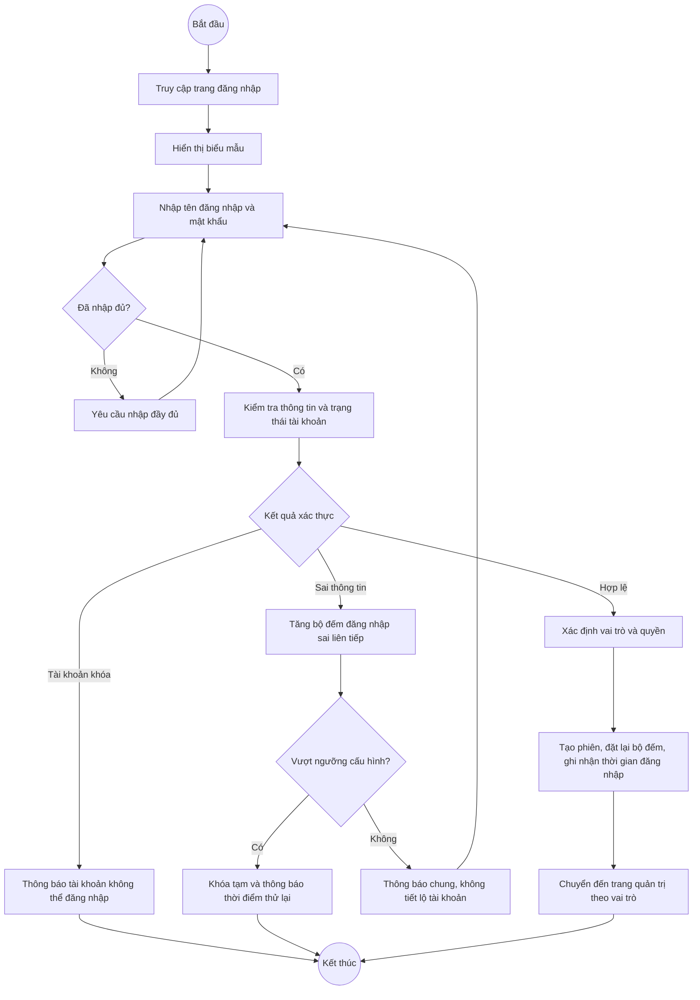
```mermaid
flowchart TD
 S((Bắt đầu)) --> A[Truy cập trang đăng nhập]
 A --> B[Hiển thị biểu mẫu]
 B --> C[Nhập tên đăng nhập và mật khẩu]
 C --> D{Đã nhập đủ?}
 D -- Không --> E[Yêu cầu nhập đầy đủ] --> C
 D -- Có --> F[Kiểm tra thông tin và trạng thái tài khoản]
 F --> G{Kết quả xác thực}
 G -- Tài khoản khóa --> I[Thông báo tài khoản không thể đăng nhập] --> Z((Kết thúc))
 G -- Sai thông tin --> H[Tăng bộ đếm đăng nhập sai liên tiếp]
 H --> H2{Vượt ngưỡng cấu hình?}
 H2 -- Có --> J[Khóa tạm và thông báo thời điểm thử lại] --> Z
 H2 -- Không --> H3[Thông báo chung, không tiết lộ tài khoản] --> C
 G -- Hợp lệ --> K[Xác định vai trò và quyền]
 K --> L[Tạo phiên, đặt lại bộ đếm, ghi nhận thời gian đăng nhập]
 L --> M[Chuyển đến trang quản trị theo vai trò]
 M --> Z
```

### UC02 – Đăng xuất

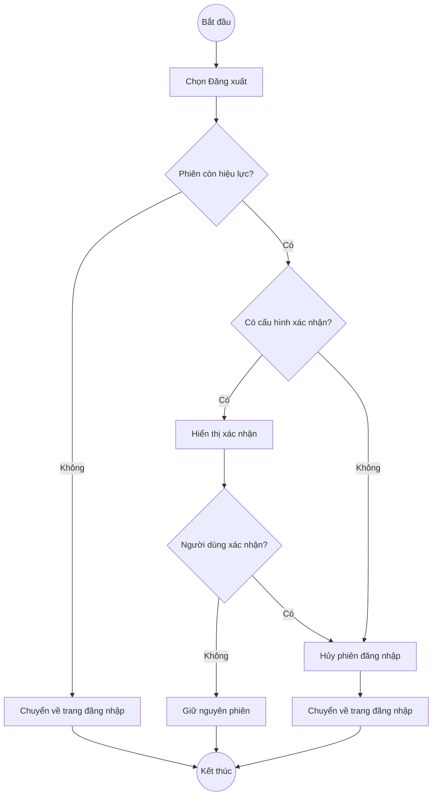
```mermaid
flowchart TD
 S((Bắt đầu)) --> A[Chọn Đăng xuất]
 A --> B{Phiên còn hiệu lực?}
 B -- Không --> C[Chuyển về trang đăng nhập] --> Z((Kết thúc))
 B -- Có --> D{Có cấu hình xác nhận?}
 D -- Có --> E[Hiển thị xác nhận]
 D -- Không --> G[Hủy phiên đăng nhập]
 E --> F{Người dùng xác nhận?}
 F -- Không --> H[Giữ nguyên phiên] --> Z
 F -- Có --> G
 G --> I[Chuyển về trang đăng nhập]
 I --> Z
```

### UC03 – Đổi mật khẩu

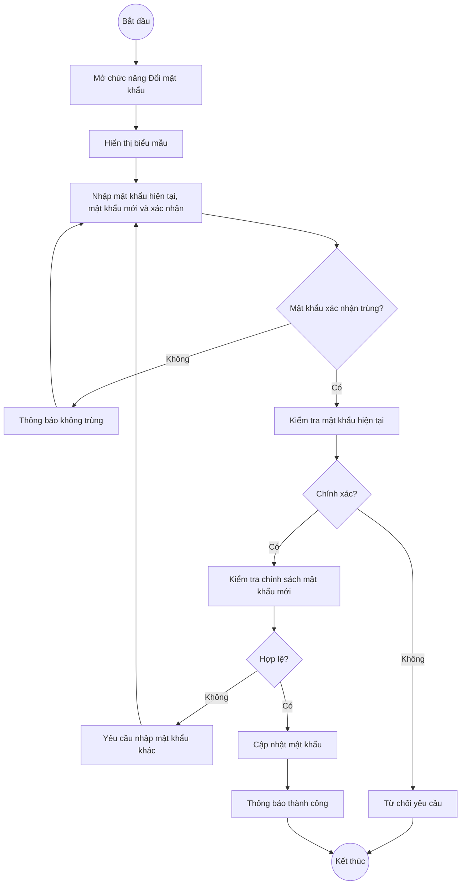
```mermaid
flowchart TD
 S((Bắt đầu)) --> A[Mở chức năng Đổi mật khẩu]
 A --> B[Hiển thị biểu mẫu]
 B --> C[Nhập mật khẩu hiện tại, mật khẩu mới và xác nhận]
 C --> D{Mật khẩu xác nhận trùng?}
 D -- Không --> E[Thông báo không trùng] --> C
 D -- Có --> F[Kiểm tra mật khẩu hiện tại]
 F --> G{Chính xác?}
 G -- Không --> H[Từ chối yêu cầu] --> Z((Kết thúc))
 G -- Có --> I[Kiểm tra chính sách mật khẩu mới]
 I --> J{Hợp lệ?}
 J -- Không --> K[Yêu cầu nhập mật khẩu khác] --> C
 J -- Có --> L[Cập nhật mật khẩu]
 L --> M[Thông báo thành công]
 M --> Z
```

### UC04 – Khôi phục mật khẩu

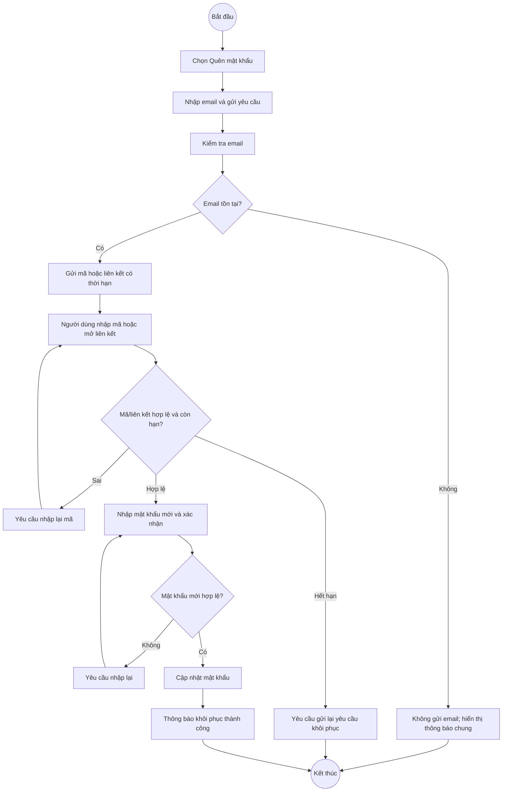
```mermaid
flowchart TD
 S((Bắt đầu)) --> A[Chọn Quên mật khẩu]
 A --> B[Nhập email và gửi yêu cầu]
 B --> C[Kiểm tra email]
 C --> D{Email tồn tại?}
 D -- Không --> E[Không gửi email; hiển thị thông báo chung] --> Z((Kết thúc))
 D -- Có --> F[Gửi mã hoặc liên kết có thời hạn]
 F --> G[Người dùng nhập mã hoặc mở liên kết]
 G --> H{Mã/liên kết hợp lệ và còn hạn?}
 H -- Sai --> I[Yêu cầu nhập lại mã] --> G
 H -- Hết hạn --> J[Yêu cầu gửi lại yêu cầu khôi phục] --> Z
 H -- Hợp lệ --> K[Nhập mật khẩu mới và xác nhận]
 K --> L{Mật khẩu mới hợp lệ?}
 L -- Không --> M[Yêu cầu nhập lại] --> K
 L -- Có --> N[Cập nhật mật khẩu]
 N --> O[Thông báo khôi phục thành công]
 O --> Z
```

### UC05 – Quản lý tài khoản nhân sự

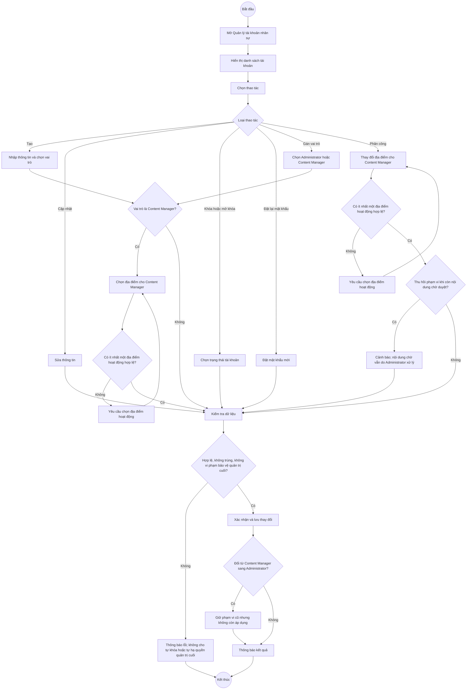
```mermaid
flowchart TD
 S((Bắt đầu)) --> A[Mở Quản lý tài khoản nhân sự]
 A --> B[Hiển thị danh sách tài khoản]
 B --> C[Chọn thao tác]
 C --> D{Loại thao tác}
 D -- Tạo --> E[Nhập thông tin và chọn vai trò]
 D -- Cập nhật --> F[Sửa thông tin]
 D -- Khóa hoặc mở khóa --> G[Chọn trạng thái tài khoản]
 D -- Đặt lại mật khẩu --> H[Đặt mật khẩu mới]
 D -- Gán vai trò --> I[Chọn Administrator hoặc Content Manager]
 D -- Phân công --> J2[Thay đổi địa điểm cho Content Manager]
 E --> L{Vai trò là Content Manager?}
 I --> L
 L -- Có --> J[Chọn địa điểm cho Content Manager]
 L -- Không --> K[Kiểm tra dữ liệu]
 F --> K
 G --> K
 H --> K
 J --> M{Có ít nhất một địa điểm hoạt động hợp lệ?}
 M -- Không --> N[Yêu cầu chọn địa điểm hoạt động] --> J
 M -- Có --> K
 J2 --> M2{Có ít nhất một địa điểm hoạt động hợp lệ?}
 M2 -- Không --> N2[Yêu cầu chọn địa điểm hoạt động] --> J2
 M2 -- Có --> T{Thu hồi phạm vi khi còn nội dung chờ duyệt?}
 T -- Có --> U[Cảnh báo; nội dung chờ vẫn do Administrator xử lý] --> K
 T -- Không --> K
 K --> O{Hợp lệ, không trùng, không vi phạm bảo vệ quản trị cuối?}
 O -- Không --> P[Thông báo lỗi; không cho tự khóa hoặc tự hạ quyền quản trị cuối] --> Z((Kết thúc))
 O -- Có --> Q[Xác nhận và lưu thay đổi]
 Q --> R{Đổi từ Content Manager sang Administrator?}
 R -- Có --> V[Giữ phạm vi cũ nhưng không còn áp dụng] --> W[Thông báo kết quả]
 R -- Không --> W
 W --> Z
```

~~M -- Có --> T{Thu hồi phạm vi khi còn nội dung chờ duyệt?}~~
**[ĐÃ SỬA 16/11]** Tách nhánh: tạo mới Content Manager sau khi chọn địa điểm hợp lệ (`M -- Có --> K`) chuyển thẳng đến bước kiểm tra dữ liệu `K`; chỉ thao tác thay đổi phân công phạm vi (`D -- Phân công`) mới đi qua nút kiểm tra thu hồi phạm vi `T`. (Lý do: Tài khoản tạo mới chưa có nội dung nên không thể phát sinh thu hồi phạm vi đang có nội dung chờ duyệt theo mục 4.6.1 của UC05, mã lỗi D2)

### UC06 – Xem danh sách và chi tiết địa điểm

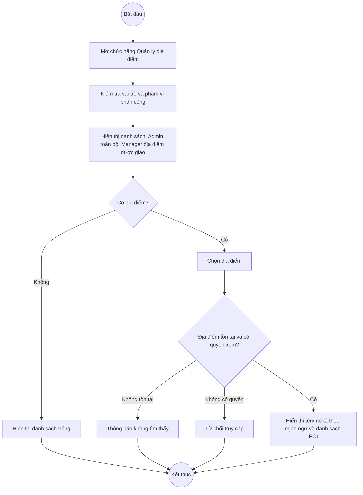
```mermaid
flowchart TD
 S((Bắt đầu)) --> A[Mở chức năng Quản lý địa điểm]
 A --> B[Kiểm tra vai trò và phạm vi phân công]
 B --> C[Hiển thị danh sách: Admin toàn bộ; Manager địa điểm được giao]
 C --> D{Có địa điểm?}
 D -- Không --> E[Hiển thị danh sách trống] --> Z((Kết thúc))
 D -- Có --> F[Chọn địa điểm]
 F --> G{Địa điểm tồn tại và có quyền xem?}
 G -- Không tồn tại --> H[Thông báo không tìm thấy] --> Z
 G -- Không có quyền --> I[Từ chối truy cập] --> Z
 G -- Có --> J[Hiển thị tên/mô tả theo ngôn ngữ và danh sách POI]
 J --> Z
```

### UC07 – Quản lý địa điểm

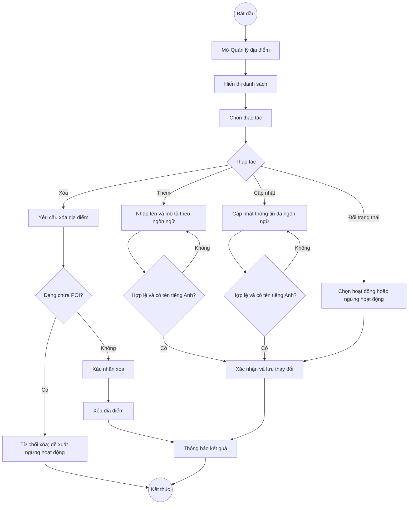
```mermaid
flowchart TD
 S((Bắt đầu)) --> A[Mở Quản lý địa điểm]
 A --> B[Hiển thị danh sách]
 B --> C[Chọn thao tác]
 C --> D{Thao tác}
 D -- Thêm --> E[Nhập tên và mô tả theo ngôn ngữ]
 D -- Cập nhật --> F[Cập nhật thông tin đa ngôn ngữ]
 D -- Đổi trạng thái --> H[Chọn hoạt động hoặc ngừng hoạt động]
 D -- Xóa --> G[Yêu cầu xóa địa điểm]
 E --> I{Hợp lệ và có tên tiếng Anh?}
 I -- Không --> E
 I -- Có --> Q[Xác nhận và lưu thay đổi]
 F --> I2{Hợp lệ và có tên tiếng Anh?}
 I2 -- Không --> F
 I2 -- Có --> Q
 H --> Q
 G --> J{Đang chứa POI?}
 J -- Có --> K[Từ chối xóa; đề xuất ngừng hoạt động] --> Z((Kết thúc))
 J -- Không --> L[Xác nhận xóa] --> M[Xóa địa điểm] --> N[Thông báo kết quả]
 Q --> N
 N --> Z
```

~~G --> J{Đang chứa POI hoặc có dữ liệu liên quan?}~~
**[ĐÃ SỬA 16/11] (loại bỏ vì tài liệu gốc không có, mã D3)** `G --> J{Đang chứa POI?}` (Lý do: Mục 4.3.1 của UC07 chỉ quy định "Địa điểm đang chứa POI", không có quy định "hoặc có dữ liệu liên quan", mã lỗi D3)

### UC08 – Xem danh sách và chi tiết POI

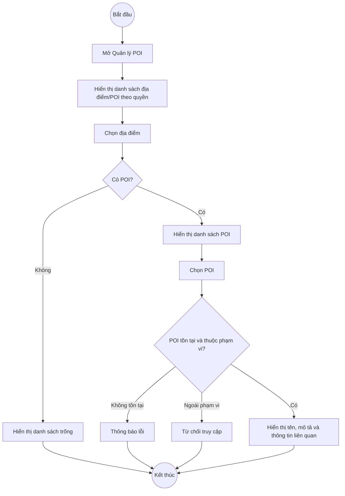
```mermaid
flowchart TD
 S((Bắt đầu)) --> A[Mở Quản lý POI]
 A --> B[Hiển thị danh sách địa điểm/POI theo quyền]
 B --> C[Chọn địa điểm]
 C --> D{Có POI?}
 D -- Không --> E[Hiển thị danh sách trống] --> Z((Kết thúc))
 D -- Có --> F[Hiển thị danh sách POI]
 F --> G[Chọn POI]
 G --> H{POI tồn tại và thuộc phạm vi?}
 H -- Không tồn tại --> I[Thông báo lỗi] --> Z
 H -- Ngoài phạm vi --> J[Từ chối truy cập] --> Z
 H -- Có --> K[Hiển thị tên, mô tả và thông tin liên quan]
 K --> Z
```

### UC09 – Quản lý POI

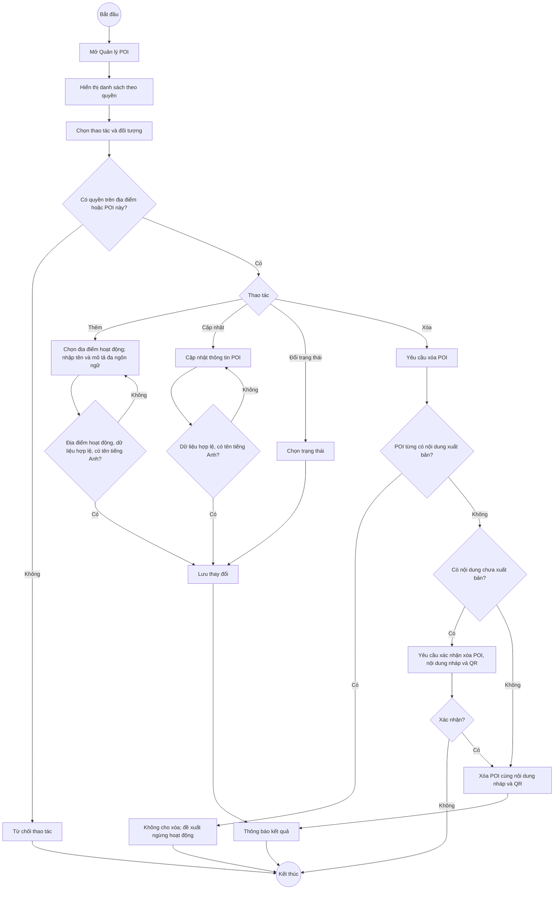
```mermaid
flowchart TD
 S((Bắt đầu)) --> A[Mở Quản lý POI]
 A --> B[Hiển thị danh sách theo quyền]
 B --> C[Chọn thao tác và đối tượng]
 C --> D{Có quyền trên địa điểm hoặc POI này?}
 D -- Không --> R[Từ chối thao tác] --> Z((Kết thúc))
 D -- Có --> O{Thao tác}
 O -- Thêm --> E[Chọn địa điểm hoạt động; nhập tên và mô tả đa ngôn ngữ]
 O -- Cập nhật --> F[Cập nhật thông tin POI]
 O -- Đổi trạng thái --> H[Chọn trạng thái]
 O -- Xóa --> G[Yêu cầu xóa POI]
 E --> V{Địa điểm hoạt động, dữ liệu hợp lệ, có tên tiếng Anh?}
 V -- Không --> E
 V -- Có --> T[Lưu thay đổi]
 F --> V2{Dữ liệu hợp lệ, có tên tiếng Anh?}
 V2 -- Không --> F
 V2 -- Có --> T
 H --> T
 T --> P[Thông báo kết quả]
 G --> J{POI từng có nội dung xuất bản?}
 J -- Có --> K[Không cho xóa; đề xuất ngừng hoạt động] --> Z
 J -- Không --> L{Có nội dung chưa xuất bản?}
 L -- Có --> M[Yêu cầu xác nhận xóa POI, nội dung nháp và QR] --> N{Xác nhận?}
 N -- Không --> Z
 N -- Có --> X[Xóa POI cùng nội dung nháp và QR]
 L -- Không --> X
 X --> P
 P --> Z
```

### UC10 – Quản lý ngôn ngữ

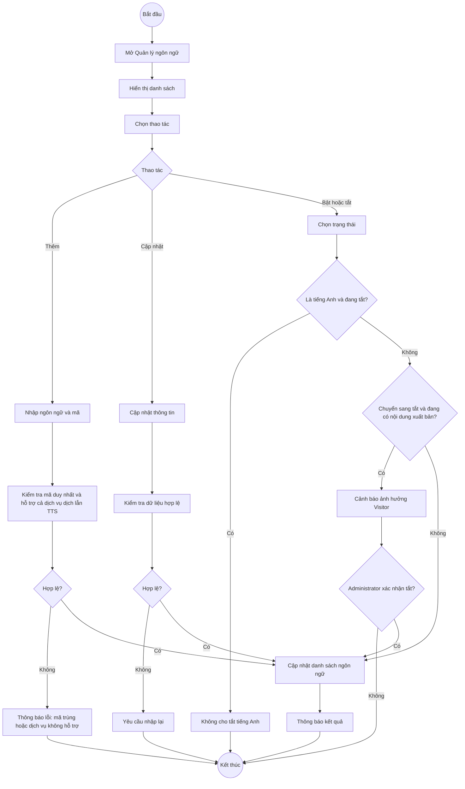
```mermaid
flowchart TD
 S((Bắt đầu)) --> A[Mở Quản lý ngôn ngữ]
 A --> B[Hiển thị danh sách]
 B --> C[Chọn thao tác]
 C --> D{Thao tác}
 D -- Thêm --> E[Nhập ngôn ngữ và mã]
 D -- Cập nhật --> F[Cập nhật thông tin]
 D -- Bật hoặc tắt --> G[Chọn trạng thái]
 E --> H[Kiểm tra mã duy nhất và hỗ trợ cả dịch vụ dịch lẫn TTS]
 H --> N{Hợp lệ?}
 N -- Không --> O[Thông báo lỗi: mã trùng hoặc dịch vụ không hỗ trợ] --> Z((Kết thúc))
 N -- Có --> P[Cập nhật danh sách ngôn ngữ]
 F --> H2[Kiểm tra dữ liệu hợp lệ]
 H2 --> N2{Hợp lệ?}
 N2 -- Không --> O2[Yêu cầu nhập lại] --> Z
 N2 -- Có --> P
 G --> I{Là tiếng Anh và đang tắt?}
 I -- Có --> J[Không cho tắt tiếng Anh] --> Z
 I -- Không --> K{Chuyển sang tắt và đang có nội dung xuất bản?}
 K -- Có --> L[Cảnh báo ảnh hưởng Visitor]
 L --> M{Administrator xác nhận tắt?}
 M -- Không --> Z
 M -- Có --> P
 K -- Không --> P
 P --> Q[Thông báo kết quả]
 Q --> Z
```

### UC11 – Thiết lập giọng đọc mặc định theo ngôn ngữ

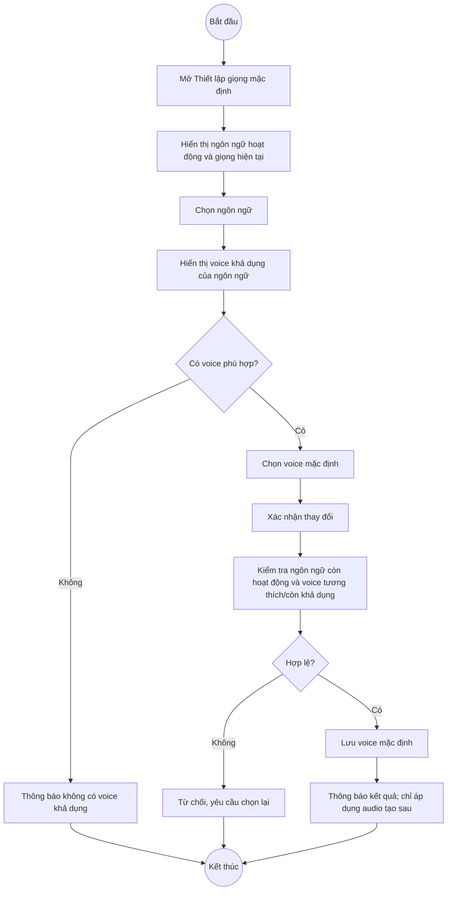
```mermaid
flowchart TD
 S((Bắt đầu)) --> A[Mở Thiết lập giọng mặc định]
 A --> B[Hiển thị ngôn ngữ hoạt động và giọng hiện tại]
 B --> C[Chọn ngôn ngữ]
 C --> D[Hiển thị voice khả dụng của ngôn ngữ]
 D --> E{Có voice phù hợp?}
 E -- Không --> F[Thông báo không có voice khả dụng] --> Z((Kết thúc))
 E -- Có --> G[Chọn voice mặc định]
 G --> H[Xác nhận thay đổi]
 H --> I[Kiểm tra ngôn ngữ còn hoạt động và voice tương thích/còn khả dụng]
 I --> J{Hợp lệ?}
 J -- Không --> K[Từ chối, yêu cầu chọn lại] --> Z
 J -- Có --> L[Lưu voice mặc định]
 L --> M[Thông báo kết quả; chỉ áp dụng audio tạo sau]
 M --> Z
```

### UC12 – Xem danh sách và chi tiết nội dung thuyết minh

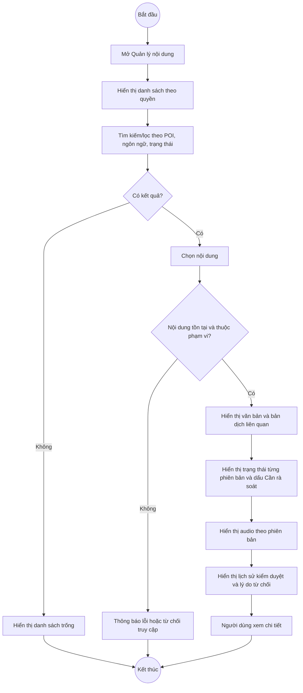
```mermaid
flowchart TD
 S((Bắt đầu)) --> A[Mở Quản lý nội dung]
 A --> B[Hiển thị danh sách theo quyền]
 B --> C[Tìm kiếm/lọc theo POI, ngôn ngữ, trạng thái]
 C --> D{Có kết quả?}
 D -- Không --> E[Hiển thị danh sách trống] --> Z((Kết thúc))
 D -- Có --> F[Chọn nội dung]
 F --> G{Nội dung tồn tại và thuộc phạm vi?}
 G -- Không --> H[Thông báo lỗi hoặc từ chối truy cập] --> Z
 G -- Có --> I[Hiển thị văn bản và bản dịch liên quan]
 I --> J[Hiển thị trạng thái từng phiên bản và dấu Cần rà soát]
 J --> K[Hiển thị audio theo phiên bản]
 K --> L[Hiển thị lịch sử kiểm duyệt và lý do từ chối]
 L --> M[Người dùng xem chi tiết]
 M --> Z
```

### UC13 – Tạo nội dung thuyết minh

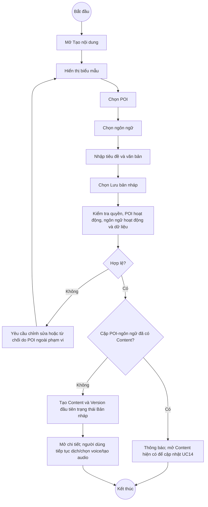
```mermaid
flowchart TD
 S((Bắt đầu)) --> A[Mở Tạo nội dung]
 A --> B[Hiển thị biểu mẫu]
 B --> C[Chọn POI]
 C --> D[Chọn ngôn ngữ]
 D --> E[Nhập tiêu đề và văn bản]
 E --> F[Chọn Lưu bản nháp]
 F --> G[Kiểm tra quyền, POI hoạt động, ngôn ngữ hoạt động và dữ liệu]
 G --> H{Hợp lệ?}
 H -- Không --> I[Yêu cầu chỉnh sửa hoặc từ chối do POI ngoài phạm vi] --> B
 H -- Có --> J{Cặp POI-ngôn ngữ đã có Content?}
 J -- Có --> K[Thông báo; mở Content hiện có để cập nhật UC14] --> Z((Kết thúc))
 J -- Không --> L[Tạo Content và Version đầu tiên trạng thái Bản nháp]
 L --> M[Mở chi tiết; người dùng tiếp tục dịch/chọn voice/tạo audio]
 M --> Z
```

### UC14 – Cập nhật và gửi duyệt nội dung thuyết minh

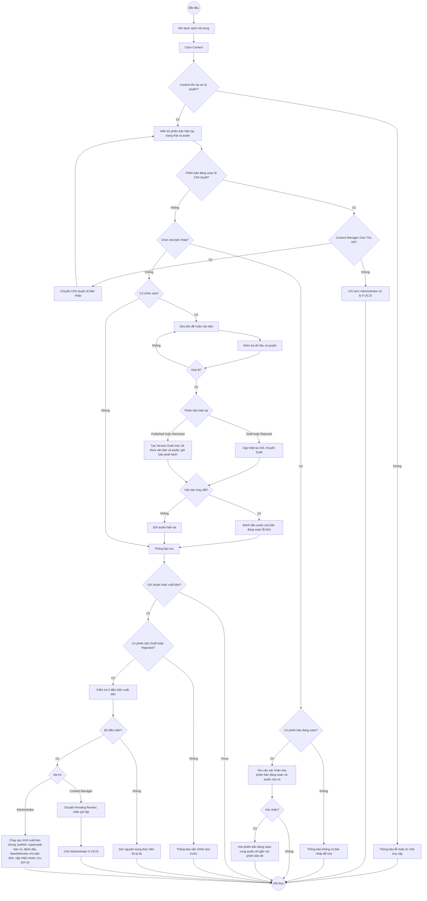
```mermaid
flowchart TD
 S((Bắt đầu)) --> A[Mở danh sách nội dung]
 A --> B[Chọn Content]
 B --> C{Content tồn tại và có quyền?}
 C -- Không --> D[Thông báo lỗi hoặc từ chối truy cập] --> Z((Kết thúc))
 C -- Có --> E[Hiển thị phiên bản hiện tại, trạng thái và audio]
 E --> F{Phiên bản đang soạn là Chờ duyệt?}
 F -- Có --> G{Content Manager chọn Thu hồi?}
 G -- Có --> H[Chuyển Chờ duyệt về Bản nháp] --> E
 G -- Không --> I[Chỉ xem; Administrator xử lý ở UC15] --> Z
 F -- Không --> J{Chọn xóa bản nháp?}
 J -- Có --> J2{Có phiên bản đang soạn?}
 J2 -- Không --> J3[Thông báo không có bản nháp để xóa] --> Z
 J2 -- Có --> K[Yêu cầu xác nhận xóa phiên bản đang soạn và audio của nó]
 K --> L{Xác nhận?}
 L -- Không --> Z
 L -- Có --> M[Xóa phiên bản đang soạn cùng audio chỉ gắn với phiên bản đó] --> Z
 J -- Không --> N{Có chỉnh sửa?}
 N -- Có --> O[Sửa tiêu đề hoặc văn bản]
 O --> P[Kiểm tra dữ liệu và quyền]
 P --> Q{Hợp lệ?}
 Q -- Không --> O
 Q -- Có --> R{Phiên bản hiện tại}
 R -- Draft hoặc Rejected --> T[Cập nhật tại chỗ; chuyển Draft]
 R -- Published hoặc Removed --> U[Tạo Version Draft mới; kế thừa văn bản và audio; giữ bản phát hành]
 T --> V{Văn bản thay đổi?}
 U --> V
 V -- Có --> W[Đánh dấu audio của bản đang soạn lỗi thời]
 V -- Không --> X[Giữ audio hiện tại]
 W --> Y[Thông báo lưu]
 X --> Y
 N -- Không --> Y
 Y --> AA{Gửi duyệt hoặc xuất bản?}
 AA -- Chưa --> Z
 AA -- Có --> AA2{Có phiên bản Draft hoặc Rejected?}
 AA2 -- Không --> AA3[Thông báo cần chỉnh sửa trước] --> Z
 AA2 -- Có --> AB[Kiểm tra 5 điều kiện xuất bản]
 AB --> AC{Đủ điều kiện?}
 AC -- Không --> AD[Giữ nguyên trạng thái; hiển thị lý do] --> Z
 AC -- Có --> AE{Vai trò}
 AE -- Content Manager --> AF[Chuyển Pending Review; chặn gửi lặp] --> AG[Chờ Administrator ở UC15] --> Z
 AE -- Administrator --> AH[Chạy quy trình xuất bản chung: publish, supersede bản cũ, đánh dấu NeedsReview cho bản dịch, cập nhật Visitor, lưu lịch sử] --> Z
```

~~Xóa phiên bản đang soạn; nếu chưa từng phát hành thì xóa Content~~
**[ĐÃ SỬA 16/11] (loại bỏ vì tài liệu gốc không có, mã D4)** Nội dung đúng theo mục 4.2 của UC14 là: *"xóa phiên bản đang soạn cùng audio chỉ gắn với phiên bản đó, rồi hiển thị kết quả"*, không có quy định xóa thực thể Content.

### UC15 – Kiểm duyệt và xuất bản nội dung

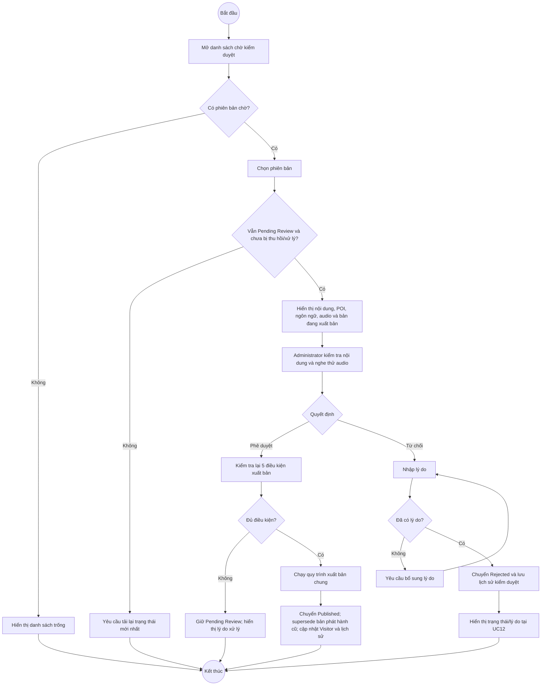
```mermaid
flowchart TD
 S((Bắt đầu)) --> A[Mở danh sách chờ kiểm duyệt]
 A --> B{Có phiên bản chờ?}
 B -- Không --> C[Hiển thị danh sách trống] --> Z((Kết thúc))
 B -- Có --> D[Chọn phiên bản]
 D --> E{Vẫn Pending Review và chưa bị thu hồi/xử lý?}
 E -- Không --> F[Yêu cầu tải lại trạng thái mới nhất] --> Z
 E -- Có --> G[Hiển thị nội dung, POI, ngôn ngữ, audio và bản đang xuất bản]
 G --> H[Administrator kiểm tra nội dung và nghe thử audio]
 H --> I{Quyết định}
 I -- Phê duyệt --> J[Kiểm tra lại 5 điều kiện xuất bản]
 J --> K{Đủ điều kiện?}
 K -- Không --> L[Giữ Pending Review; hiển thị lý do xử lý] --> Z
 K -- Có --> M[Chạy quy trình xuất bản chung]
 M --> N[Chuyển Published; supersede bản phát hành cũ; cập nhật Visitor và lịch sử] --> Z
 I -- Từ chối --> O[Nhập lý do]
 O --> P{Đã có lý do?}
 P -- Không --> Q[Yêu cầu bổ sung lý do] --> O
 P -- Có --> R[Chuyển Rejected và lưu lịch sử kiểm duyệt]
 R --> T[Hiển thị trạng thái/lý do tại UC12]
 T --> Z
```

### UC16 – Gỡ xuất bản và xuất bản lại nội dung

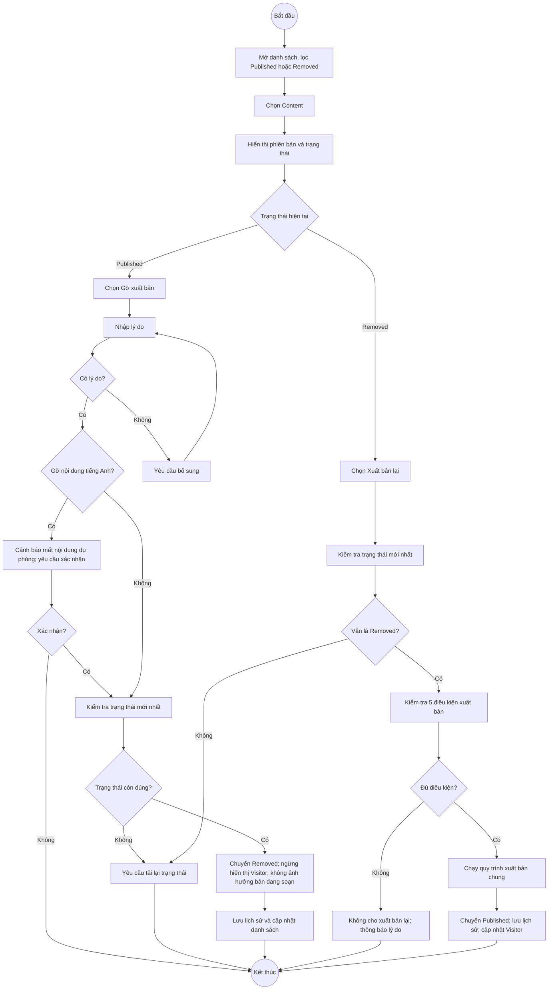
```mermaid
flowchart TD
 S((Bắt đầu)) --> A[Mở danh sách, lọc Published hoặc Removed]
 A --> B[Chọn Content]
 B --> C[Hiển thị phiên bản và trạng thái]
 C --> D{Trạng thái hiện tại}
 D -- Published --> E[Chọn Gỡ xuất bản]
 D -- Removed --> F[Chọn Xuất bản lại]
 E --> G[Nhập lý do]
 G --> H{Có lý do?}
 H -- Không --> I[Yêu cầu bổ sung] --> G
 H -- Có --> J{Gỡ nội dung tiếng Anh?}
 J -- Có --> K[Cảnh báo mất nội dung dự phòng; yêu cầu xác nhận]
 K --> L{Xác nhận?}
 L -- Không --> Z((Kết thúc))
 L -- Có --> M[Kiểm tra trạng thái mới nhất]
 J -- Không --> M
 M --> N{Trạng thái còn đúng?}
 N -- Không --> O[Yêu cầu tải lại trạng thái] --> Z
 N -- Có --> P[Chuyển Removed; ngừng hiển thị Visitor; không ảnh hưởng bản đang soạn]
 P --> Q[Lưu lịch sử và cập nhật danh sách] --> Z
 F --> F2[Kiểm tra trạng thái mới nhất]
 F2 --> F3{Vẫn là Removed?}
 F3 -- Không --> O
 F3 -- Có --> R[Kiểm tra 5 điều kiện xuất bản]
 R --> T{Đủ điều kiện?}
 T -- Không --> U[Không cho xuất bản lại; thông báo lý do] --> Z
 T -- Có --> V[Chạy quy trình xuất bản chung]
 V --> W[Chuyển Published; lưu lịch sử; cập nhật Visitor]
 W --> Z
```

### UC17 – Yêu cầu dịch tự động

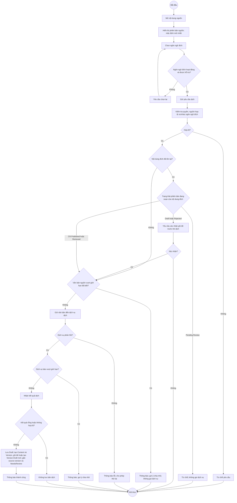
```mermaid
flowchart TD
 S((Bắt đầu)) --> A[Mở nội dung nguồn]
 A --> B[Hiển thị phiên bản nguồn; mặc định mới nhất]
 B --> C[Chọn ngôn ngữ đích]
 C --> D{Ngôn ngữ đích hoạt động và được hỗ trợ?}
 D -- Không --> E[Yêu cầu chọn lại] --> C
 D -- Có --> F[Gửi yêu cầu dịch]
 F --> G[Kiểm tra quyền, nguồn hợp lệ và khác ngôn ngữ đích]
 G --> H{Hợp lệ?}
 H -- Không --> I[Từ chối yêu cầu] --> Z((Kết thúc))
 H -- Có --> R{Nội dung đích đã tồn tại?}
 R -- Không --> LM
 R -- Có --> U{Trạng thái phiên bản đang soạn của nội dung đích}
 U -- Pending Review --> AA[Từ chối; không gọi dịch vụ] --> Z
 U -- Draft hoặc Rejected --> V[Yêu cầu xác nhận ghi đè trước khi dịch]
 V --> W{Xác nhận?}
 W -- Không --> Z
 W -- Có --> LM
 U -- Chỉ Published hoặc Removed --> LM
 LM{Văn bản nguồn vượt giới hạn đã biết?}
 LM -- Có --> N[Thông báo; gợi ý chia nhỏ; không gọi dịch vụ] --> Z
 LM -- Không --> J[Gửi văn bản đến dịch vụ dịch]
 J --> K{Dịch vụ phản hồi?}
 K -- Không --> L[Thông báo lỗi; cho phép thử lại] --> Z
 K -- Có --> M{Dịch vụ báo vượt giới hạn?}
 M -- Có --> N2[Thông báo; gợi ý chia nhỏ] --> Z
 M -- Không --> O[Nhận kết quả dịch]
 O --> P{Kết quả rỗng hoặc không hợp lệ?}
 P -- Có --> Q[Không lưu bản dịch] --> Z
 P -- Không --> X[Lưu Draft: tạo Content và Version, ghi đè hoặc tạo Version Draft mới; gắn source-version và NeedsReview]
 X --> T[Thông báo thành công] --> Z
```

### UC18 – Rà soát và chỉnh sửa bản dịch

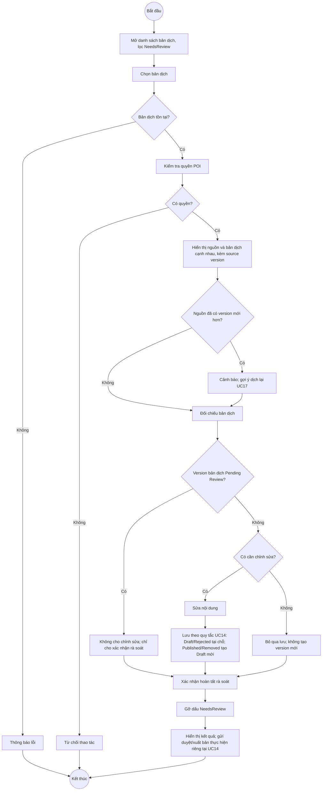
```mermaid
flowchart TD
 S((Bắt đầu)) --> A[Mở danh sách bản dịch, lọc NeedsReview]
 A --> B[Chọn bản dịch]
 B --> C{Bản dịch tồn tại?}
 C -- Không --> D[Thông báo lỗi] --> Z((Kết thúc))
 C -- Có --> E[Kiểm tra quyền POI]
 E --> F{Có quyền?}
 F -- Không --> G[Từ chối thao tác] --> Z
 F -- Có --> H[Hiển thị nguồn và bản dịch cạnh nhau, kèm source version]
 H --> I{Nguồn đã có version mới hơn?}
 I -- Có --> J[Cảnh báo; gợi ý dịch lại UC17]
 I -- Không --> K[Đối chiếu bản dịch]
 J --> K
 K --> L{Version bản dịch Pending Review?}
 L -- Có --> M[Không cho chỉnh sửa; chỉ cho xác nhận rà soát]
 L -- Không --> N{Có cần chỉnh sửa?}
 N -- Có --> O[Sửa nội dung]
 O --> P[Lưu theo quy tắc UC14: Draft/Rejected tại chỗ; Published/Removed tạo Draft mới]
 N -- Không --> Q[Bỏ qua lưu; không tạo version mới]
 M --> R[Xác nhận hoàn tất rà soát]
 P --> R
 Q --> R
 R --> T[Gỡ dấu NeedsReview]
 T --> U[Hiển thị kết quả; gửi duyệt/xuất bản thực hiện riêng tại UC14]
 U --> Z
```

### UC19 – Chọn giọng đọc

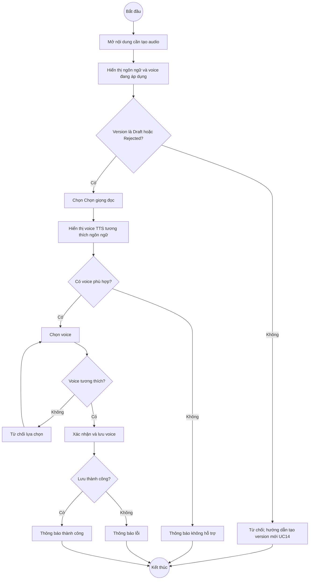
```mermaid
flowchart TD
 S((Bắt đầu)) --> A[Mở nội dung cần tạo audio]
 A --> B[Hiển thị ngôn ngữ và voice đang áp dụng]
 B --> C{Version là Draft hoặc Rejected?}
 C -- Không --> D[Từ chối; hướng dẫn tạo version mới UC14] --> Z((Kết thúc))
 C -- Có --> E[Chọn Chọn giọng đọc]
 E --> F[Hiển thị voice TTS tương thích ngôn ngữ]
 F --> G{Có voice phù hợp?}
 G -- Không --> H[Thông báo không hỗ trợ] --> Z
 G -- Có --> I[Chọn voice]
 I --> J{Voice tương thích?}
 J -- Không --> K[Từ chối lựa chọn] --> I
 J -- Có --> L[Xác nhận và lưu voice]
 L --> M{Lưu thành công?}
 M -- Không --> N[Thông báo lỗi] --> Z
 M -- Có --> O[Thông báo thành công]
 O --> Z
```

### UC20 – Yêu cầu tạo audio TTS

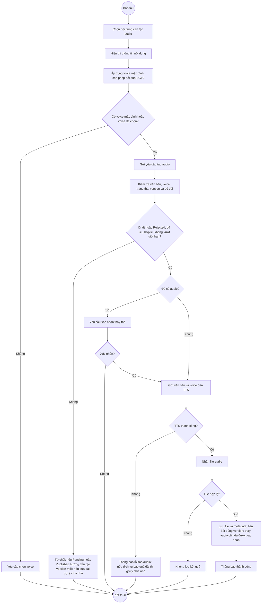
```mermaid
flowchart TD
 S((Bắt đầu)) --> A[Chọn nội dung cần tạo audio]
 A --> B[Hiển thị thông tin nội dung]
 B --> C[Áp dụng voice mặc định; cho phép đổi qua UC19]
 C --> D{Có voice mặc định hoặc voice đã chọn?}
 D -- Không --> E[Yêu cầu chọn voice] --> Z((Kết thúc))
 D -- Có --> F[Gửi yêu cầu tạo audio]
 F --> G[Kiểm tra văn bản, voice, trạng thái version và độ dài]
 G --> H{Draft hoặc Rejected, dữ liệu hợp lệ, không vượt giới hạn?}
 H -- Không --> I[Từ chối; nếu Pending hoặc Published hướng dẫn tạo version mới; nếu quá dài gợi ý chia nhỏ] --> Z
 H -- Có --> J{Đã có audio?}
 J -- Có --> K[Yêu cầu xác nhận thay thế]
 K --> L{Xác nhận?}
 L -- Không --> Z
 L -- Có --> M[Gửi văn bản và voice đến TTS]
 J -- Không --> M
 M --> N{TTS thành công?}
 N -- Không --> O[Thông báo lỗi tạo audio; nếu dịch vụ báo quá dài thì gợi ý chia nhỏ] --> Z
 N -- Có --> R[Nhận file audio]
 R --> T{File hợp lệ?}
 T -- Không --> U[Không lưu kết quả] --> Z
 T -- Có --> V[Lưu file và metadata; liên kết đúng version; thay audio cũ nếu được xác nhận]
 V --> W[Thông báo thành công]
 W --> Z
```

### UC21 – Nghe thử audio

```mermaid
flowchart TD
 S((Bắt đầu)) --> A[Truy cập nội dung có audio]
 A --> B[Chọn Nghe thử]
 B --> C[Kiểm tra quyền với POI và tải file]
 C --> D{File tồn tại?}
 D -- Không --> E[Thông báo audio không tồn tại] --> Z((Kết thúc))
 D -- Có --> F{Tải thành công?}
 F -- Không --> G[Yêu cầu thử lại] --> Z
 F -- Có --> H[Hiển thị trình phát]
 H --> I[Người dùng nhấn Phát]
 I --> J{Audio phát được?}
 J -- Không --> K[Thông báo lỗi phát] --> Z
 J -- Có --> L[Phát để người dùng kiểm tra chất lượng]
 L --> M[Người dùng dừng hoặc kết thúc]
 M --> N[Kết thúc nghe thử; không đổi trạng thái xuất bản]
 N --> Z
```

### UC22 – Quản lý audio

```mermaid
flowchart TD
 S((Bắt đầu)) --> A[Mở Quản lý audio]
 A --> B[Hiển thị audio hiện tại của version]
 B --> C{Version Draft hoặc Rejected?}
 C -- Không --> D[Từ chối; hướng dẫn tạo version mới UC14] --> Z((Kết thúc))
 C -- Có --> E[Chọn thao tác]
 E --> F{Tải lên, thay thế hay xóa?}
 F -- Tải lên --> G[Chọn file audio thu sẵn]
 F -- Thay thế --> G
 F -- Xóa --> H[Xác nhận xóa audio]
 H --> I{Xác nhận?}
 I -- Không --> Z
 I -- Có --> J[Kiểm tra quyền và hủy liên kết file audio với phiên bản] --> K[Thông báo kết quả] --> Z
 G --> L[Kiểm tra quyền, định dạng, dung lượng và ngôn ngữ]
 L --> M{Hợp lệ?}
 M -- Không --> N[Từ chối file hoặc yêu cầu sửa] --> Z
 M -- Có --> O[Lưu/thay thế audio và liên kết đúng version]
 O --> K
```

~~J[Kiểm tra quyền và xóa liên kết/file theo quy tắc lưu trữ]~~
**[ĐÃ SỬA 16/11] (loại bỏ vì tài liệu gốc không có, mã D5)** `J[Kiểm tra quyền và hủy liên kết file audio với phiên bản]` (Lý do: Kịch bản 4.2 của UC22 quy định "hủy liên kết file với phiên bản", không đưa quy tắc lưu trữ file vật lý vào sơ đồ nghiệp vụ, mã lỗi D5)

### UC23 – Truy cập trang web thuyết minh

```mermaid
flowchart TD
 S((Bắt đầu)) --> A[Visitor mở website]
 A --> B[Khởi tạo trang]
 B --> C[Đọc ngôn ngữ đã lưu trên thiết bị]
 C --> D{Đã lưu ngôn ngữ?}
 D -- Có --> E[Sử dụng ngôn ngữ đã lưu]
 D -- Không --> F{Ngôn ngữ trình duyệt được hỗ trợ?}
 F -- Có --> G[Dùng ngôn ngữ trình duyệt]
 F -- Không --> H[Dùng tiếng Anh]
 E --> I[Tải cấu hình và dữ liệu]
 G --> I
 H --> I
 I --> J{Kết nối và dữ liệu tải được?}
 J -- Không kết nối --> K[Thông báo lỗi kết nối] --> Z((Kết thúc))
 J -- Dữ liệu lỗi --> L[Thông báo và cho phép thử lại] --> Z
 J -- Có --> M[Hiển thị trang chủ]
 M --> N[Ghi nhận lượt truy cập ẩn danh]
 N --> O[Visitor bắt đầu sử dụng]
 O --> Z
```

### UC24 – Chọn ngôn ngữ sử dụng

```mermaid
flowchart TD
 S((Bắt đầu)) --> A[Mở chức năng Chọn ngôn ngữ]
 A --> B[Tải danh sách ngôn ngữ hoạt động]
 B --> C{Tải thành công?}
 C -- Không --> D[Thông báo lỗi] --> Z((Kết thúc))
 C -- Có --> E[Hiển thị danh sách]
 E --> F[Visitor chọn ngôn ngữ]
 F --> G{Ngôn ngữ còn hoạt động?}
 G -- Không --> H[Yêu cầu chọn ngôn ngữ khác] --> E
 G -- Có --> I[Lưu lựa chọn trên thiết bị]
 I --> J{Lưu được?}
 J -- Có --> K[Cập nhật giao diện và ngôn ngữ ưu tiên]
 J -- Không --> L[Chỉ áp dụng trong phiên hiện tại]
 K --> M[Thông báo lựa chọn thành công]
 L --> M
 M --> Z
```

### UC25 – Duyệt và chọn địa điểm tham quan

```mermaid
flowchart TD
 S((Bắt đầu)) --> A[Mở danh sách địa điểm]
 A --> B[Tải địa điểm đang hoạt động]
 B --> C{Có địa điểm?}
 C -- Không --> D[Thông báo không có địa điểm] --> Z((Kết thúc))
 C -- Có --> E[Hiển thị tên/mô tả theo ngôn ngữ; thiếu thì tiếng Anh]
 E --> F[Visitor chọn địa điểm]
 F --> G{Địa điểm còn hoạt động?}
 G -- Không --> H[Thông báo không thể truy cập] --> Z
 G -- Có --> I[Tải chi tiết địa điểm]
 I --> J{Tải thành công?}
 J -- Không --> K[Thông báo lỗi kết nối] --> Z
 J -- Có --> L[Hiển thị địa điểm được chọn]
 L --> Z
```

### UC26 – Xem danh sách POI

```mermaid
flowchart TD
 S((Bắt đầu)) --> A[Visitor chọn địa điểm]
 A --> B[Tải danh sách POI thuộc địa điểm]
 B --> E[Lọc POI đang hoạt động]
 E --> C{Còn POI hiển thị?}
 C -- Không --> D[Thông báo địa điểm chưa có POI] --> Z((Kết thúc))
 C -- Có --> F[Hiển thị tên và mô tả theo ngôn ngữ; thiếu thì tiếng Anh]
 F --> G[Visitor chọn POI]
 G --> H{POI tồn tại?}
 H -- Không --> I[Thông báo lỗi] --> Z
 H -- Có --> J[Chuyển đến chi tiết POI]
 J --> Z
```

### UC27 – Xem nội dung thuyết minh

```mermaid
flowchart TD
 S((Bắt đầu)) --> A[Visitor chọn POI]
 A --> B{POI đang hoạt động?}
 B -- Không --> C[Thông báo POI không khả dụng] --> Z((Kết thúc))
 B -- Có --> D[Kiểm tra ngôn ngữ ưu tiên]
 D --> E[Tìm version Published theo ngôn ngữ]
 E --> F{Có nội dung?}
 F -- Có --> G[Tải và hiển thị văn bản]
 F -- Không --> H[Tìm nội dung Published tiếng Anh]
 H --> I{Có tiếng Anh?}
 I -- Không --> J[Thông báo chưa có nội dung thuyết minh] --> Z
 I -- Có --> K[Thông báo dùng tiếng Anh; tải và hiển thị văn bản]
 G --> L[Visitor đọc nội dung]
 K --> L
 G -- Không tải được --> M[Thông báo lỗi tải nội dung] --> Z
 K -- Không tải được --> M
 L --> Z
```

~~G -. Không tải được .-> M[Thông báo lỗi tải nội dung] --> Z~~
~~K -. Không tải được .-> M~~
**[ĐÃ SỬA 16/11]** `G -- Không tải được --> M[Thông báo lỗi tải nội dung] --> Z` và `K -- Không tải được --> M`. (Lý do: Đổi nét đứt sang nét liền chuẩn Mermaid để nhất quán với toàn bộ các activity diagram khác theo kịch bản phụ 4.1 của UC27, mã lỗi D6)

### UC28 – Nghe thuyết minh

```mermaid
flowchart TD
 S((Bắt đầu)) --> A[Truy cập chi tiết POI]
 A --> B[Chọn Nghe thuyết minh]
 B --> C[Kiểm tra nội dung Published theo ngôn ngữ]
 C --> D{Có nội dung ngôn ngữ ưu tiên?}
 D -- Có --> F[Chọn nội dung và audio đúng ngôn ngữ]
 D -- Không --> E1[Tìm nội dung Published tiếng Anh]
 E1 --> E2{Có tiếng Anh?}
 E2 -- Không --> E3[Thông báo chưa có nội dung thuyết minh] --> Z((Kết thúc))
 E2 -- Có --> E[Chọn nội dung và audio tiếng Anh]
 E --> G[Tải audio]
 F --> G
 G --> H{Audio tải được?}
 H -- Không --> I[Thông báo lỗi; cho thử lại; vẫn hiển thị văn bản] --> Z
 H -- Có --> J[Hiển thị trình phát]
 J --> K[Visitor nhấn Phát]
 K --> L{Audio phát được?}
 L -- Không --> M[Thông báo lỗi trình phát] --> Z
 L -- Có --> N[Ghi nhận lượt nghe khi bắt đầu phát]
 N --> O[Lưu lịch sử POI trên Local Storage]
 O --> P[Tiếp tục nghe hoặc điều khiển qua UC29]
 P --> Z
```

### UC29 – Điều khiển trình phát audio

```mermaid
flowchart TD
 S((Bắt đầu)) --> A[Mở trình phát đã khởi tạo]
 A --> B[Hiển thị điều khiển]
 B --> C[Visitor chọn thao tác]
 C --> D{Thao tác}
 D -- Phát --> E{Audio tải đủ?}
 E -- Không --> F[Tiếp tục tải trước khi phát] --> G[Thực hiện phát]
 E -- Có --> G
 D -- Tạm dừng --> H[Tạm dừng]
 D -- Tiếp tục --> I{Audio đã kết thúc?}
 I -- Có --> J[Phát lại từ đầu]
 I -- Không --> G
 D -- Tua --> K{Vị trí tua hợp lệ?}
 K -- Không --> L[Giữ vị trí hiện tại] --> B
 K -- Có --> M[Cập nhật vị trí phát]
 D -- Dừng --> N[Thực hiện dừng]
 N --> N2{Dừng được?}
 N2 -- Không --> O[Thông báo lỗi] --> Z((Kết thúc))
 N2 -- Có --> P
 G --> P[Cập nhật trạng thái và thời gian phát]
 H --> P
 J --> P
 M --> P
 P --> Q[Ghi nhận thời lượng nghe thực tế]
 Q --> R{Tiếp tục nghe?}
 R -- Có --> B
 R -- Không --> Z
```

### UC30 – Chuyển ngôn ngữ thuyết minh

```mermaid
flowchart TD
 S((Bắt đầu)) --> A[Đang xem/nghe POI hoạt động]
 A --> B[Chọn Chuyển ngôn ngữ]
 B --> C[Hiển thị ngôn ngữ hoạt động]
 C --> D[Visitor chọn ngôn ngữ mới]
 D --> E{Ngôn ngữ còn hoạt động?}
 E -- Không --> F[Yêu cầu chọn lại] --> C
 E -- Có --> G[Kiểm tra nội dung Published]
 G --> H{Có nội dung ngôn ngữ mới?}
 H -- Không --> I[Chọn tiếng Anh và thông báo]
 H -- Có --> J[Chọn nội dung ngôn ngữ mới]
 I --> K[Tải văn bản và audio]
 J --> K
 K --> L{Tải nội dung thành công?}
 L -- Không --> M[Giữ nguyên nội dung trước đó] --> Z((Kết thúc))
 L -- Có --> N[Cập nhật giao diện]
 N --> O{Audio tải được?}
 O -- Không --> P[Vẫn hiển thị văn bản; thông báo lỗi audio]
 O -- Có --> Q[Cập nhật trình phát]
 P --> R[Lưu ngôn ngữ mới trên thiết bị]
 Q --> R
 R --> Z
```

### UC31 – Xem lịch sử nghe trên thiết bị

```mermaid
flowchart TD
 S((Bắt đầu)) --> A[Mở chức năng Lịch sử nghe]
 A --> B[Đọc Local Storage]
 B --> C{Đọc được?}
 C -- Không --> D[Thông báo lỗi đọc Local Storage] --> Z((Kết thúc))
 C -- Có --> E{Có lịch sử?}
 E -- Không --> F[Hiển thị danh sách trống] --> Z
 E -- Có --> G[Hiển thị POI đã nghe]
 G --> H[Visitor chọn một POI]
 H --> I[Kiểm tra trạng thái POI và nội dung]
 I --> J{POI hoạt động và nội dung còn Published?}
 J -- Không hoạt động --> K[Thông báo POI không thể truy cập] --> Z
 J -- Nội dung bị gỡ --> L[Thông báo nội dung không khả dụng] --> Z
 J -- Có --> M[Mở thông tin POI]
 M --> Z
```

### UC32 – Quản lý QR Code cho POI

```mermaid
flowchart TD
 S((Bắt đầu)) --> A[Mở Quản lý QR Code]
 A --> B[Hiển thị danh sách POI theo quyền]
 B --> C[Chọn POI]
 C --> D{POI tồn tại và có quyền?}
 D -- Không --> E[Thông báo lỗi hoặc từ chối truy cập] --> Z((Kết thúc))
 D -- Có --> F[Kiểm tra QR Code hiện tại]
 F --> G[Chọn thao tác]
 G --> H{Thao tác}
 H -- Tạo mới --> I{QR đã tồn tại?}
 I -- Có --> J[Thông báo; cho xem hoặc tạo lại] --> G
 I -- Không --> K[Tạo QR chứa URL truy cập POI]
 H -- Cập nhật hoặc tạo lại --> K
 H -- Xem --> L0{POI đã có QR?}
 L0 -- Không --> L1[Thông báo chưa có QR; đề nghị tạo mới] --> G
 L0 -- Có --> L[Hiển thị QR]
 H -- Tải --> M0{POI đã có QR?}
 M0 -- Không --> L1
 M0 -- Có --> M[Đọc QR và tải xuống]
 K --> N{Tạo thành công?}
 N -- Không --> O[Thông báo lỗi tạo QR] --> Z
 N -- Có --> P[Lưu QR và liên kết POI]
 P --> Q[Thông báo kết quả] --> Z
 L --> Q
 M --> R{Tải thành công?}
 R -- Không --> T[Cho phép thử lại] --> Z
 R -- Có --> Q
```

### UC33 – Quét QR Code và truy cập POI

```mermaid
flowchart TD
 S((Bắt đầu)) --> A[Visitor quét QR bằng camera]
 A --> B[Thiết bị mở URL trong trình duyệt]
 B --> C[Hệ thống phân giải POI từ URL]
 C --> D{URL hợp lệ và POI tồn tại?}
 D -- Không --> E[Thông báo POI không tồn tại] --> Z((Kết thúc))
 D -- Có --> F{POI đang hoạt động?}
 F -- Không --> G[Thông báo POI không khả dụng] --> Z
 F -- Có --> H[Xác định ngôn ngữ: đã lưu > browser được hỗ trợ > English]
 H --> I[Tìm nội dung Published theo ngôn ngữ]
 I --> J{Có nội dung?}
 J -- Không --> K[Tìm tiếng Anh]
 K --> L{Có nội dung tiếng Anh?}
 L -- Không --> M[Thông báo nội dung chưa khả dụng] --> Z
 L -- Có --> N[Thông báo dùng tiếng Anh; hiển thị trang POI]
 J -- Có --> O[Hiển thị trang POI]
 N --> P[Ghi nhận lượt quét QR ẩn danh]
 O --> P
 P --> Q[Visitor xem hoặc nghe thuyết minh]
 Q --> Z
```

### UC34 – Xem thống kê hoạt động

```mermaid
flowchart TD
 S((Bắt đầu)) --> A[Administrator mở Thống kê hoạt động]
 A --> B[Hiển thị trang tổng quan]
 B --> C[Tổng hợp truy cập, lượt nghe, theo Location/POI/ngôn ngữ, thời lượng và lượt quét QR]
 C --> D{Có dữ liệu?}
 D -- Không --> E[Hiển thị 0 hoặc thông báo chưa có dữ liệu]
 D -- Có --> F[Hiển thị chỉ số tổng hợp]
 E --> G[Administrator chọn khoảng thời gian]
 F --> G
 G --> H{Khoảng thời gian hợp lệ?}
 H -- Không --> I[Yêu cầu chọn lại] --> G
 H -- Có --> J[Lọc dữ liệu hoạt động thực tế theo khoảng thời gian]
 J --> K{Có bản ghi?}
 K -- Không --> L[Hiển thị kết quả trống]
 K -- Có --> M[Cập nhật biểu đồ/chỉ số; tên POI/địa điểm bằng tiếng Anh]
 L --> N[Administrator xem và phân tích]
 M --> N
 N --> Z((Kết thúc))
 J -. Không tải được .-> O[Thông báo lỗi thống kê] --> Z
```

